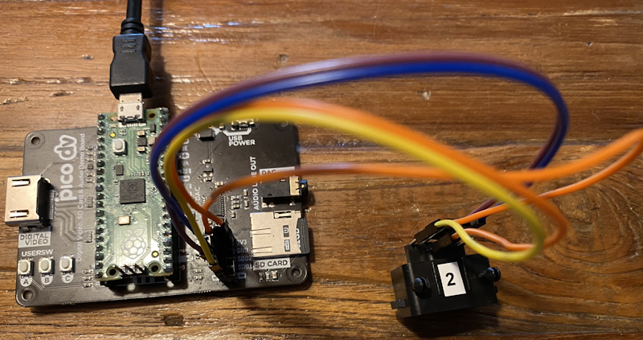
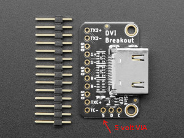
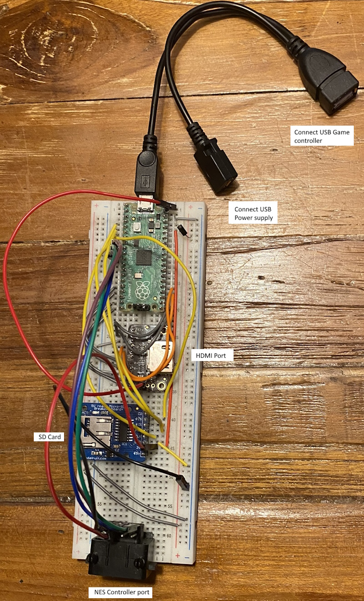
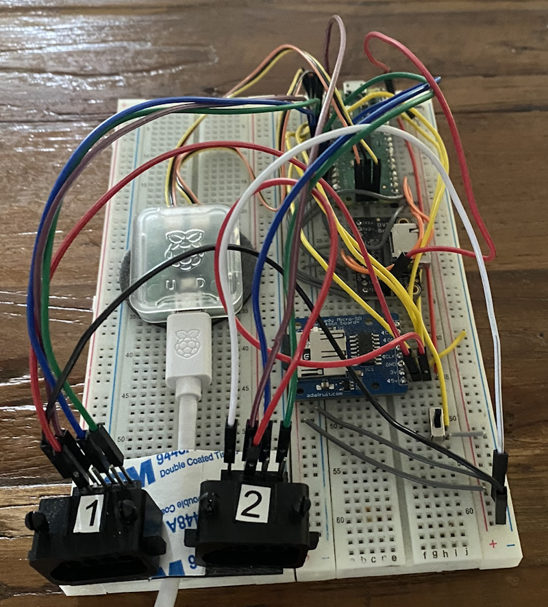
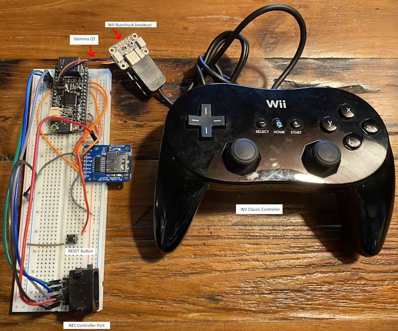
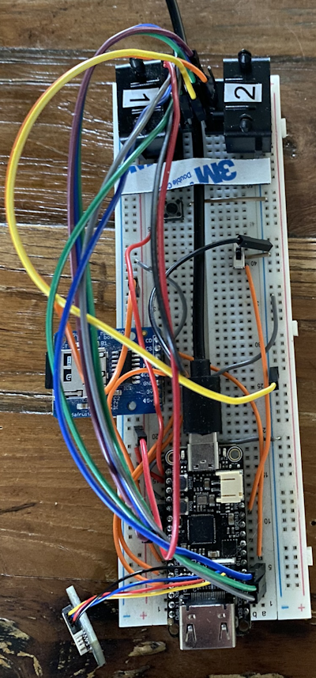
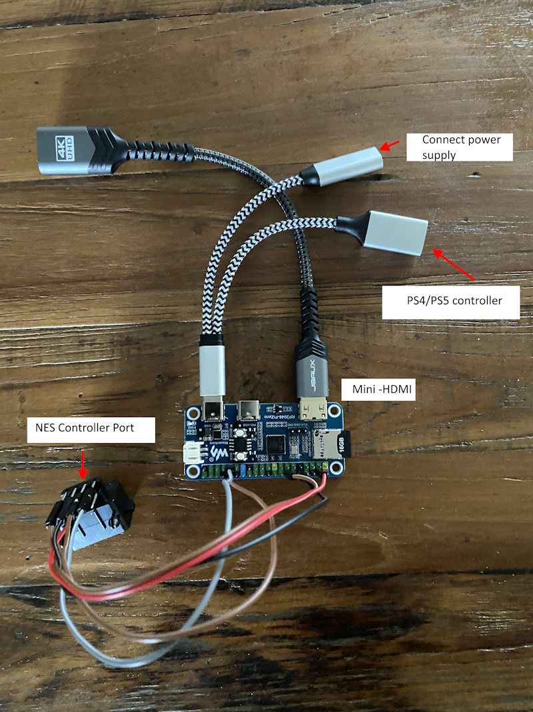

# pico-infonesPlus.

## Introduction


A NES (Nintendo Entertainment System) emulator with SD card and menu support for the Raspberry Pi Pico, Raspberry Pi Pico 2 and other RP2040/RP2350 based microcontrollers. Uses HDMI for display. 

Supports two controllers for two player games. [See "about two player games" below for specifics and limitations](#about-two-player-games) 

The emulator used is  [Infones by Jay Kumogata](https://github.com/jay-kumogata/InfoNES) which was ported to the [Raspberry Pi Pico by Shuichi Takano](https://github.com/shuichitakano/pico-infones) with changes done by me to accomodate the SD card menu.

Create a FAT32 formatted SD card and copy your NES roms on to it. It is possible to organize your roms into different folders. Then insert the SD Card into the card slot. Needless to say you must own all the roms you put on the card.

A menu is added to the emulator, which reads the roms from the SD card and shows them on screen for the user to select,  flash and play.

See below for [possible configurations](#possible-configurations), [supported game controllers](#gamecontroller-support) and how to [setup](#setup).  There is even a custom [PCB (printed circuit board)](#pcb-with-raspberry-pi-pico-or-pico-2) available and a [3D-printable case design](https://github.com/fhoedemakers/pico-infonesPlus#3d-printed-case) which fits the PCB.

[See also the Adafruit guide](https://learn.adafruit.com/nes-emulator-for-rp2040-dvi-boards), although it is outdated now. 

There is also an emulator port for the Sega Master System/Sega Game Gear and DMG Game Boy. You can find them here:

- Sega Master System/Game Gear: [https://github.com/fhoedemakers/pico-smsplus](https://github.com/fhoedemakers/pico-smsplus)
- DMG Game Boy: [https://github.com/fhoedemakers/pico-peanutGB](https://github.com/fhoedemakers/pico-peanutGB)

***

## Video
Click on image below to see a demo video.

[](https://www.youtube.com/watch?v=OEcpNMNzZCQ)

***

## Possible configurations

You can use it with these RP2040/RP2350 boards and configurations:

- Raspberry Pi Pico or Pico 2. Requires one of these addons:
  - [Pimoroni Pico DV Demo Base](https://shop.pimoroni.com/products/pimoroni-pico-dv-demo-base?variant=39494203998291) hdmi add-on board. For use with a USB gamecontroller or up to two a legacy NES controllers. (NES controller ports require soldering)
  - Breadboard and
    - [Adafruit DVI Breakout For HDMI Source Devices](https://www.adafruit.com/product/4984)
    - [Adafruit Micro-SD breakout board+](https://www.adafruit.com/product/254).
      
    For use with a USB gamecontroller or up to two legacy NES controllers. (No soldering requirerd)
    
  - A custom printed circuit board (PCB) designed by [@johnedgarpark](https://twitter.com/johnedgarpark). (requires soldering) Up to two NES controller ports can be added to this PCB. Can also be used with a USB gamecontroller. You can 3d print your own NES-like case for the PCB.
 


- [Adafruit Feather RP2040 with DVI](https://www.adafruit.com/product/5710) (HDMI) Output Port. For use with a USB gamecontroller, up to two legacy NES controllers, or even a WII classic controller. Requires these addons:
  - Breadboard
  - SD reader  (choose one below)
    - [Adafruit Micro-SD breakout board+](https://www.adafruit.com/product/254).
    - [FeatherWing - RTC + SD](https://www.adafruit.com/product/2922). (not tested by me, but should work)
   
- [Waveshare RP2040-PiZero Development Board](https://www.waveshare.com/rp2040-pizero.htm)

  For use with a USB gamecontroller, up to two legacy NES controllers, or a WII classic controller. (No soldering requirerd)

  You can 3d print your own NES-like case for for this board. This does require some soldering.


[See below to see how to setup your specific configuration.](#Setup)

> [!NOTE]
> It seems that sellers on AliExpress have copied the PCB design and are selling pre-populated PCB's. I do not condone this in any way. 
> For questions about those boards, please contact the seller on AliExpress.

***

## Gamecontroller support
Depending on the hardware configuration, the emulator supports these gamecontrollers:

### USB Controllers
- Sony Dual Shock 4
- Sony Dual Sense
- BUFFALO BGC-FC801 connected to USB - not tested
- Genesis Mini 1 and 2
- PlayStation Classic
- Keyboard
- XInput type of controllers like Xbox 360 and Xbox One controllers and other XInput compatible controllers like 8bitDo.
- Mantapad, cheap [NES](https://nl.aliexpress.com/w/wholesale-nes-controller-usb.html?spm=a2g0o.home.search.0) and [SNES](https://nl.aliexpress.com/w/wholesale-snes-controller-usb.html?spm=a2g0o.productlist.search.0) USB controllers from AliExpress.

See also [troubleshooting USB controllers below](#troubleshooting-usb-controllers)

>[!NOTE]
> There is some input lag when using USB controllers.

### Legacy controllers
- One or optional two original NES controllers for two player games.  In some configurations, soldering is required.
- WII-classic controller: Adafruit Feather RP2040 and WaveShare RP2040 Pi-Zero boards only
      
Parts list for legacy controllers
  * NES Controller. A second controller port and controller is optional and only needed if you want to play two player games using NES controllers. Two player games can also be played with a USB controller and a NES controller.
    * [NES controller port](https://www.zedlabz.com/products/controller-connector-port-for-nintendo-nes-console-7-pin-90-degree-replacement-2-pack-black-zedlabz)
    * [An original NES controller](https://www.amazon.com/s?k=NES+controller&crid=1CX7W9NQQDF8H&sprefix=nes+controller%2Caps%2C174&ref=nb_sb_noss_1)

  * WII-Classic controller 
    *  [Adafruit Wii Nunchuck Breakout Adapter - Qwiic / STEMMA QT](https://www.adafruit.com/product/4836)
    *  Adafruit Feather RP2040: [Adafruit STEMMA QT / Qwiic JST SH 4-pin Cable](https://www.adafruit.com/product/4210)
    *  Waveshare RP2040-PiZero Development Board: [STEMMA QT / Qwiic JST SH 4-pin Cable with Premium Female Sockets](https://www.adafruit.com/product/4397)
    *  [WII Classic wired controller](https://www.amazon.com/s?k=wii-classic+controller)

***

## About two player games

The emulator supports two player games using two NES controllers or an USB gamecontroller and a NES controller.

> [!NOTE]
> You cannot use two USB controllers for two player games.
> At the moment only one USB controller is recognized by the driver. In this case the USB controller is always player 1. Player 2 must be a NES controller.


| | Player 1 | Player 2 |
| --- | -------- | -------- |
| USB controller connected | USB | NES port 1 or NES port 2 |
| No usb controller connected | NES port 1| NES port 2 |

***

## Warning
Repeatedly flashing your Pico will eventually wear out the flash memory. 

The emulator overclocks the Pico in order to get the emulator working fast enough. Overclocking can reduce the Pico's lifespan.

Use this software at your own risk! I will not be responsible in any way for any damage to your Pico and/or connected peripherals caused by using this software.

I also do not take responsability in any way when damage is caused to the Pico or display due to incorrect wiring or voltages.

***

# Setup

Click on the link below for your specific board configuration:

- [Raspberry Pi Pico or Pico 2, setup for Pimoroni Pico DV Demo Base](#raspberry-pi-pico-or-pico-2-setup-for-pimoroni-pico-dv-demo-base)
- [Raspberry Pi Pico or Pico 2, setup with Adafruit hardware and breadboard](#raspberry-pi-pico-or-pico-2-setup-with-adafruit-hardware-and-breadboard)
- [Adafruit Feather RP2040 with DVI (HDMI) Output Port setup](#adafruit-feather-rp2040-with-dvi-hdmi-output-port-setup)
- [Waveshare RP2040-PiZero Development Board](#waveshare-rp2040-pizero-development-board)
  * [3D printed case for this board](#3d-printed-case-for-rp2040-pizero)
- [Printed Circuit Board (PCB) for Raspberry Pi Pico or Pico 2](#pcb-with-raspberry-pi-pico-or-pico-2)
  * [3D printed case for this PCB](#3d-printed-case-for-pcb)

***

##  Raspberry Pi Pico or Pico 2, setup for Pimoroni Pico DV Demo Base.

### materials needed
- Raspberry Pi Pico or Pico 2 with soldered male headers.
- [Pimoroni Pico DV Demo Base](https://shop.pimoroni.com/products/pimoroni-pico-dv-demo-base?variant=39494203998291).
- [Micro usb to usb OTG Cable](https://a.co/d/dKW6WGe)
- Controllers (Depending on what you have)
  - Dual Shock 4 or Dual Sense Controller.
  - one or two NES Controllers.
    - [NES controller port](https://www.zedlabz.com/products/controller-connector-port-for-nintendo-nes-console-7-pin-90-degree-replacement-2-pack-black-zedlabz). Requires soldering.
    - [An original NES controller](https://www.amazon.com/s?k=NES+controller&crid=1CX7W9NQQDF8H&sprefix=nes+controller%2Caps%2C174&ref=nb_sb_noss_1)
    - Optional: A sconde NES controller port and controller if you want to play two player games.
    - [Dupont wires](https://a.co/d/cJVmnQO)
    - [Mail or female headers to be soldered on the board](https://a.co/d/dSNPuyo)
- HDMI Cable.
- Micro usb power adapter.
- Micro usb to usb cable when using the Duak Shock 4 controller
- USB C to USB data cable when using the Sony Dual Sense controller.
- FAT 32 formatted Micro SD card with roms you legally own. Roms must have the .nes extension. You can organise your roms into different folders.


### flashing the Pico
- When using a Pico, download **piconesPlusPimoroniDV.uf2** from the [releases page](https://github.com/fhoedemakers/pico-infonesPlus/releases/latest).
- When using a Pico 2, download **pico2_piconesPlusPimoroniDV.uf2** from the [releases page](https://github.com/fhoedemakers/pico-infonesPlus/releases/latest).
- Push and hold the BOOTSEL button on the Pico, then connect to your computer using a micro usb cable. Release BOOTSEL once the drive RPI-RP2 appears on your computer.
- Drag and drop the UF2 file on to the RPI-RP2 drive. The Raspberry Pi Pico will reboot and will now run the emulator.

### Pinout

#### NES controller port(s) (if you want to use legacy NES controllers).


|          | Port 1 | Port 2 (optional) |Note  |
| ------------- | ------------- | ------------- | ----------- |
| GND           |               |               | GND (- on board) |
| VCC (Power)   |               |               | Connect to 3V3  |
| NES Clock     | GPIO14        |    GPIO1      |             | 
| NES LATCH     | GPIO16        |    GPIO20     |             |
| NES Data      | GPIO15         |   GPIO21     |             |

> [!NOTE]
> Soldering is required.
> There is only one 3v3 pin header on the board, the other 3V3 must be soldered directly onto pin 36 (3V3 OUT) of the Pico.
> For GND there are two pin headers available on the board.
> Clock Data and Latch for NES controller port 1 must be soldered directly onto the Pico.
> The Clock, Data and Latch for NES controller port 2 can be soldered on the available pin headers on the board, no need to solder them directly onto the Pico.


### setting up the hardware
- Disconnect the Pico from your computer.
- Attach the Pico to the DV Demo Base.
- Connect the HDMI cable to the Demo base and your monitor.
- Connect the usb OTG cable to the Pico's usb port.
- Depending which controller you want to use:
  - Connect the controller to the other end of the usb OTG.
  - Connect legacy NES controller(s) to NES controller port(s).
- Insert the SD card into the SD card slot.
- Connect the usb power adapter to the usb port of the Demo base. (USB POWER)
- Power on the monitor and the Pico

### Image: Usb controller only


### Image: one or two player setup with usb controller and NES controller port 2

In this image the NES controller port is wired to port 2.

For single player games: use USB controller. 

For two player games: Connect a USB controller for player 1 and a NES controller for player 2.



### Image: Two player setup using two NES controllers or a USB controller and a NES controller

Controller port 1 pins must be soldered directly onto the Pico.

Controller port 2 pins can be soldered to the available headers of the Pimoroni DV. 

For two player games: 

- Connect two NES controllers or
- Connect a USB controller for player 1 and a NES controller for player 2. You can use either NES controller ports.

NOIMAGE - TODO

***

## Raspberry Pi Pico or Pico 2, setup with Adafruit hardware and breadboard

### materials needed
- Raspberry Pi Pico or Pico 2 with soldered male headers.
- [Adafruit DVI Breakout For HDMI Source Devices](https://www.adafruit.com/product/4984)
- [Adafruit Micro-SD breakout board+](https://www.adafruit.com/product/254)
- [Micro usb to OTG Y-Cable](https://a.co/d/b9t11rl)
- [Breadboard](https://www.amazon.com/s?k=breadboard&crid=1E5ZFUFWE6HNI&sprefix=breadboard%2Caps%2C167&ref=nb_sb_noss_2)
- [Breadboard jumper wires](https://a.co/d/2NoWOgK)
- Controllers (Depending on what you have)
  - one or two NES controllers.
    - [NES controller port](https://www.zedlabz.com/products/controller-connector-port-for-nintendo-nes-console-7-pin-90-degree-replacement-2-pack-black-zedlabz)
    - [An original NES controller](https://www.amazon.com/s?k=NES+controller&crid=1CX7W9NQQDF8H&sprefix=nes+controller%2Caps%2C174&ref=nb_sb_noss_1)
    - [Dupont male to female wires](https://a.co/d/cJVmnQO)
  - Dual Shock 4 or Dual Sense Controller.
- HDMI Cable.
- Micro usb power adapter.
- Usb C to usb cable when using the Sony Dual Sense controller.
- Micro usb to usb cable when using a Dual Shock 4.
- FAT 32 formatted Micro SD card with roms you legally own. Roms must have the .nes extension. You can organize your roms into different folders.


### flashing the Pico
- When using a Pico, download **piconesPlusAdaFruitDVISD.uf2** from the [releases page](https://github.com/fhoedemakers/pico-infonesPlus/releases/latest).
- When using a Pico 2, download **pico2_piconesPlusAdaFruitDVISD.uf2** from the [releases page](https://github.com/fhoedemakers/pico-infonesPlus/releases/latest).
- Push and hold the BOOTSEL button on the Pico, then connect to your computer using a micro usb cable. Release BOOTSEL once the drive RPI-RP2 appears on your computer. Or when already powered-on. Press and hold BOOTSEL, then press RUN on the board.
- Drag and drop the UF2 file on to the RPI-RP2 drive. The Raspberry Pi Pico will reboot and will now run the emulator.

### Pinout 

See https://www.raspberrypi.com/documentation/microcontrollers/images/pico-pinout.svg for the pinout schema of the Raspberry Pi Pico.

Use the breadboard to connect all together:

- Wire Pico Pin 38 to the breadboard ground column (-)
- Wire the breadboard left ground column (-) with the breadboard right ground column (-)

#### Adafruit Micro-SD breakout board+

|  Breakout     | GPIO   | Note     |
| ------------- | ------ | -------------- |
| CS            | GPIO5    |               |
| CLK (SCK)     | GPIO2    |               |
| DI (MOSI)     | GPIO3    |               |
| DO (MISO)     | GPIO4    |               |
| 3V            |        | Pin 36 (3v3 OUT)            |
| GND           |        | Ground on breadboard (-) |

#### Adafruit DVI Breakout For HDMI Source Devices

|  Breakout     | GPIO | Note|
| ------------- | ---- | ---------- |
| D0+           | GPIO12 |         |
| D0-           | GPIO13 |         |
| CK+           | GPIO14 |         |
| CK-           | GPIO15 |         |
| D2+           | GPIO16 |         |
| D2-           | GPIO17 |         |
| D1+           | GPIO18 |         |
| D1-           | GPIO19 |         |
| 5 (*)         | VBUS | Pin 40 (5volt) |
| GND (3x)      |      | Ground on breadboard (-)     |

(*) This is the via on the side of the board marked 5. (next to via D and C). 



#### NES controller port(s). (if you want to use legacy NES controllers).
|           | Port1 | Port 2 (optional) | Note |
| ------------- | ---- | -------- |---------- |
| GND           |      | | |Ground on breadboard (-) |
| VCC (Power)   |      |   |(3v3 OUT)        |
| NES Clock     | GPIO6  | GPIO9 |          |
| NES LATCH     | GPIO8  | GPIO11 |          |
| NES Data      | GPIO7  | GPIO10 |          |


### setting up the hardware

- Disconnect the Pico from your computer.
- Attach the Pico to the breadboard.
- Insert the SD card into the SD card slot.
- Connect the HDMI cable to the Adafruit HDMI Breakout board and to your monitor.
- Connect the usb OTG Y-cable to the Pico's usb port.
- Connect the Micro usb power adapter to the female Micro usb connecter of the OTG Y-Cable.
- Controllers (Depending on what you have)
  - Connect the USB-controller to the full size female usb port of the OTG Y-Cable.
  - Connect your NES controller(s) to the NES controller port(s).
- Power on the monitor and the Pico

See image below. 

> [!NOTE]
> The Shotky Diode (VSYS - Pin 39 to breadboard + column) and the wire on breadboard left (+) to right (+) are not necessary, but recommended when powering the Pico from a Raspberry Pi.
> [See Chapter 4.6 - Powering the Board of the Raspberry Pi Pico Getting Started guide](https://datasheets.raspberrypi.com/pico/getting-started-with-pico.pdf) 

### Image: one or two player setup with usb controller and NES controller port

In this image the NES controller port is wired to port 1.

For single player games, connect either an USB controller **or** a NES controller. Not both!

For two player games: Connect a USB controller for player 1 and a NES controller for player 2.



### Image: Two player setup using two NES controllers or a USB controller and a NES controller

Choose either of the following:

- Connect two NES controllers 
- Connect a USB controller for player 1 and a NES controller for player 2. You can use either NES controller ports.

> [!NOTE]
> The device on the left is a Pico Debug probe used for debugging. This is optional



***

##  Adafruit Feather RP2040 with DVI (HDMI) Output Port setup

### materials needed

- [Adafruit Feather RP2040 with DVI (HDMI) Output Port](https://www.adafruit.com/product/5710)
- SD Reader (Choose one below)
  * [Adafruit Micro-SD breakout board+](https://www.adafruit.com/product/254) together with a breadboard.
  * [FeatherWing - RTC + SD](https://www.adafruit.com/product/2922) - not tested by me, but should work.
- [Breadboard](https://www.amazon.com/s?k=breadboard&crid=1E5ZFUFWE6HNI&sprefix=breadboard%2Caps%2C167&ref=nb_sb_noss_2)
- [Breadboard jumper wires](https://a.co/d/2NoWOgK)
- USB-C to USB data cable.
- HDMI Cable.
- FAT 32 formatted Micro SD card with roms you legally own. Roms must have the .nes extension. You can organise your roms into different folders.
- Optional: a push button like [this](https://www.kiwi-electronics.com/nl/drukknop-12mm-10-stuks-403?country=NL&utm_term=403&gclid=Cj0KCQjwho-lBhC_ARIsAMpgMoeZIyZD1ZW5GKC0r7iTBCxEP84dIZLqFfoup1D0XNOnpevkp06oyDoaAojJEALw_wcB).

When using a USB gamecontroller this is needed:
- [USB C male to micro USB female cable](https://www.amazon.com/Adapter-Connector-Charging-Compatible-Z3-Black/dp/B07Z9FLJG3/ref=sr_1_5?keywords=usb+c+male+to+micro+usb+female&qid=1688473279&sprefix=usb+c+male+to+micro+%2Caps%2C159&sr=8-5)
- [Micro usb to OTG Y-Cable](https://a.co/d/b9t11rl)
- Micro usb power adapter
- Usb C to usb cable when using the Sony Dual Sense controller.
- Micro usb to usb cable when using a Dual Shock 4.

When using legacy controllers, this is needed:
  * USB-C Power supply   
  * Depending on what you have:
    * one or two NES Controllers.
      * [NES controller port](https://www.zedlabz.com/products/controller-connector-port-for-nintendo-nes-console-7-pin-90-degree-replacement-2-pack-black-zedlabz)
      * [An original NES controller](https://www.amazon.com/s?k=NES+controller&crid=1CX7W9NQQDF8H&sprefix=nes+controller%2Caps%2C174&ref=nb_sb_noss_1)
      * [Dupont male to female wires](https://a.co/d/cJVmnQO)
    * WII-Classic controller
      *  [Adafruit Wii Nunchuck Breakout Adapter - Qwiic / STEMMA QT](https://www.adafruit.com/product/4836)
      *  [Adafruit STEMMA QT / Qwiic JST SH 4-pin Cable](https://www.adafruit.com/product/4210)
      *  [WII Classic wired controller](https://www.amazon.com/Classic-Controller-Nintendo-Wii-Remote-Console/dp/B0BYNHWS1V/ref=sr_1_1_sspa?crid=1I66OX5L05507&keywords=Wired+WII+Classic+controller&qid=1688119981&sprefix=wired+wii+classic+controller%2Caps%2C150&sr=8-1-spons&sp_csd=d2lkZ2V0TmFtZT1zcF9hdGY&psc=1)
  
### Pinout 
See: https://learn.adafruit.com/assets/119662 for the Feather pin scheme.

Use the breadboard to connect all together:

- Wire the 3.3V Pin to the breadboard + column.
- Wire the GND Pin to the breadboard - column
- Wire the breadboard left ground column (-) with the breadboard right ground column (-)
- Optional: Attach a push button to the breadboard and connect a wire from this button to the Feather RST pin and breadboard ground column(-). This adds an extra easy to access Reset button.

#### Adafruit Micro-SD breakout board+

|  Breakout     | GPIO   |      |
| ------------- | ------ | -------------- |
| CS            | GPIO10    |              |
| CLK (SCK)     | GPIO14    |               |
| DI (MOSI)     | GPIO15   |               |
| DO (MISO)     | GPIO8   |               |
| 5V            | USB     | pin labelled USB on feather       |
| 3V            |        | See Note below
| GND           |        | - column on breadboard connected to feather ground pin|

> [!NOTE]
> The Adafruit Micro-SD breakout board+ has also a 3V input pin which can be connected to + column on breadboard connected to feather 3.3V pin. However, this gave me frequently errors trying to mount the SD card. So use 5V in stead.

#### WII  nunchuck breakout adapter.

Connect the nunchuck breakout adapter to the Feather DVI using the STEMMA QT cable.

#### NES controller port(s). (if you want to use legacy NES controllers).

|               | Port 1 | Port 2 (optional) | Note |
| ------------- | ---- | ------ | ---------- |
| GND           |      | | - column on breadboard connected to feather ground pin |
| VCC (Power)   |      | | + column on breadboard connected to feather 3.3V pin         |
| NES Clock     | GPIO5 | GPIO26 |          |
| NES LATCH     | GPIO9 | GPIO27 |        |
| NES Data      | GPIO6 | GPIO28 |        |


### flashing the Feather RP2040
- Download **piconesPlusFeatherDVI.uf2** from the [releases page](https://github.com/fhoedemakers/pico-infonesPlus/releases/latest).
- Connect the feather to a USB port on your computer using the USB-C data cable.
- On the feather, push and hold the BOOTSEL button, then press RESET. Release the buttons, the drive RPI-RP2 should appear on your computer.
- Drag and drop the UF2 file on to the RPI-RP2 drive. The Raspberry Pi Pico will reboot and will now run the emulator.

> [!NOTE]
>  When the emulator won't start after flashing or powering on, and the screen shows 'No signal,' press the reset button once again. The emulator should now boot.

### setting up the hardware

- Disconnect the Pico from your computer.
- Attach the Adafruit Feather RP2040 DVI to the breadboard.
- Insert the SD card into the SD card slot.
- Connect the HDMI cable to the HDMI port of the Adafruit Feather and to your monitor.
- Connect controllers depending on your setup:
  - Legacy controllers.
    - NES Controller to the NES controller port.
    - WII-Classic controller to the Nunchuck Breakout Adapter.
    - Connect USB-C power supply to USB-C connector.
  - USB game Controllers
    * Connect the USB C connector of the "male USB C to female micro usb cable" to the USB C port of the feather.
    * Connect the female micro USB port of the "male USB C to female micro usb cable" to the male micro USB port of the USB OTG Y cable.
    * Connect the Dual Sense or Dual Shock controller with the appropriate cable to the full size female usb port of the OTG Y-Cable.
    * Connect the Micro usb power adapter to the female Micro usb connecter of the OTG Y-Cable.
- Power on the monitor and the Pico

### Image: one or two player setup with usb controller and NES/WII_classic controller port

In this image the NES controller port is wired to port 1.

For single player games, connect either an USB controller **or** a NES/WII-classic controller. Not both!

For two player games: Connect a USB controller for player 1 and a NES or WII-Classic controller for player 2.



### Image: Two player setup using two NES controllers or a USB controller and a NES/WII-classic controller

Choose either of the following:

- Connect two NES controllers
- Connect a WII-Classic Controller for player 1 and a NES-Controller on port 2 for player 2
- Connect a USB controller for player 1 and a NES controller for player 2. You can use either NES controller ports. You can also use the WII-classic controller for player 2.




***

## Waveshare RP2040-PiZero Development Board

### materials needed

- [Waveshare RP2040-PiZero Development Board](https://www.waveshare.com/rp2040-pizero.htm).
- [USB-C to USB-C - USB-A Y cable](https://a.co/d/eteMZLt). (when using an USB controller)
- [USB-C to USB-A cable](https://a.co/d/2i7rJid) for flashing the uf2 onto the board.
- USB-C Power supply. Connect to the port labelled USB, not PIO-USB. See note below.
- [Mini HDMI to HDMI Cable](https://a.co/d/5BZg3Z6).
- FAT 32 formatted Micro SD card with roms you legally own. Roms must have the .nes extension. You can organise your roms into different folders.

> [!NOTE]
> The PIO-USB cannot be used to connect the USB controller because DVI and PIO-USB cannot be used simultaneously. [See productpage](https://www.waveshare.com/rp2040-pizero.htm) Therefore, connect the controller and the power adapter to the Y-cable, and then connect the Y-cable to the port on the board labeled "USB." While the PIO-USB can be used to power the board, I don't recommend this due to occasional strange behavior it has caused.

#### NES controller port.

When using a original NES controller you need:

- [NES controller port](https://www.zedlabz.com/products/controller-connector-port-for-nintendo-nes-console-7-pin-90-degree-replacement-2-pack-black-zedlabz)
- [An original NES controller](https://www.amazon.com/s?k=NES+controller&crid=1CX7W9NQQDF8H&sprefix=nes+controller%2Caps%2C174&ref=nb_sb_noss_1)
- [Dupont female to female wires](https://a.co/d/cJVmnQO)

For two player games with two NES controllers you need an extra NES controller port, controller and wire


|           | Port 1 | Port 2 (Optional) | Note |
| ------------- | ---- | ----- | ---------- |
| GND           |      | | Any ground pin |
| VCC (Power)   |      | | 5Volt pin         |
| NES Clock     | GPIO5 | GPIO10 |          |
| NES LATCH     | GPIO9 | GPIO11|        |
| NES Data      | GPIO6 | GPIO12|        |


> [!NOTE]
> Contrary to other configurations where VCC is connected to 3Volt, VCC should be connected to a 5Volt pin. Otherwise the NES controller could possibly not work.

#### WII-Classic controller.

When using a WII-Classic controller you need:

-  [Adafruit Wii Nunchuck Breakout Adapter - Qwiic / STEMMA QT](https://www.adafruit.com/product/4836)
-  [STEMMA QT / Qwiic JST SH 4-pin Cable with Premium Female Sockets](https://www.adafruit.com/product/4397) 
-  [WII Classic wired controller](https://www.amazon.com/s?k=wii-classic+controller)

Connections are as follows:

| Nunchuck Breakout Adapter | RP2040-PiZero |
| ---------------------- | ------------ |
| 3.3V                   | 3V3          |
| GND                    | GND          |
| SDA                    | GPIO2        |
| SCL                    | GPIO3        |

### flashing the Waveshare RP2040-PiZero Development Board
- Download **piconesPlusWsRP2040PiZero.uf2** from the [releases page](https://github.com/fhoedemakers/pico-infonesPlus/releases/latest).
- Connect the USB-C port marked USB (not PIO-USB) to a USB port on your computer using the USB-C to USB-A data cable.
- On the board, push and hold the BOOT button, then press RUN. Release the buttons, the drive RPI-RP2 should appear on your computer.
- Drag and drop the UF2 file on to the RPI-RP2 drive. The board will reboot and will now run the emulator.


> [!NOTE]
>  When the emulator won't start after flashing or powering on, and the screen shows 'No signal,' press the run button once again. The emulator should now boot.

### Image: one or two player setup with usb controller and NES controller port

In this image the NES controller port is wired to port 1.

For single player games, connect either an USB controller **or** a NES controller. Not both!

For two player games: Connect a USB controller for player 1 and a NES controller for player 2.




### Image: Two player setup using two NES controllers or a USB controller and a NES controller

Choose either of the following:

- Connect two NES controllers 
- Connect a USB controller for player 1 and a NES controller for player 2. You can use either NES controller ports.


### Image: Using a wii-classic controller


### 3D printed case for RP2040-PiZero

Gavin Knight ([DynaMight1124](https://github.com/DynaMight1124)) designed a NES-like case you can 3d-print as an enclosure for this board.  This enclosure is designed for 2 NES controller ports so you can play 1 or 2-player games. [Click here for the design](https://www.thingiverse.com/thing:6758682). Please contact the creator on his Thingiverse page if you have any questions about this case.


***

## PCB with Raspberry Pi Pico or Pico 2

Create your own Pico-based NES console. It features two NES controller ports for 1 or 2-player games.

Designed by [@johnedgarpark](https://twitter.com/johnedgarpark)


Several Companies  can make these PCBs for you. 

I personally recommend [PCBWay](https://www.pcbway.com/). The boards i ordered from them are of excellent quality. They have also a very short lead time. Boards i ordered on Monday arrived from China to my home in the Netherlands on Friday of the same week.

[](https://www.pcbway.com/)

When ordering, simply upload the zip file containing the gerber design.  This file (pico_nesPCB_v2.0.zip) is available in the [releases page](https://github.com/fhoedemakers/pico-infonesPlus/releases/latest) and can also be found in the [PCB](PCB/) folder. 

> [!NOTE]
>  Soldering skills are required. Make sure you solder all the connections from the Pico onto the PCB. Also the connections on the short right-side of the Pico. (For ground)

> [!NOTE]
> If you are looking for the previous design (v0.2). You can find it [here](PCB/v0.2)

> [!NOTE]
> It seems that sellers on AliExpress have copied the PCB design and are selling pre-populated PCB's. I do not condone this in any way. For questions about those boards, please contact the seller on AliExpress.

Other materials needed:

- Raspberry Pi Pico or Pico 2 **with no headers**.
- [Adafruit DVI Breakout Board - For HDMI Source Devices](https://www.adafruit.com/product/4984)
- [Adafruit Micro SD SPI or SDIO Card Breakout Board - 3V ONLY!](https://www.adafruit.com/product/4682)
- For the NES Controllers:
  * [1 or 2 NES controller port(s)](https://www.zedlabz.com/products/controller-connector-port-for-nintendo-nes-console-7-pin-90-degree-replacement-2-pack-black-zedlabz)
  * [1 or 2 NES controller(s)](https://www.amazon.com/s?k=NES+controller&crid=1CX7W9NQQDF8H&sprefix=nes+controller%2Caps%2C174&ref=nb_sb_noss_1)
- [Micro usb to OTG Y-Cable](https://a.co/d/b9t11rl) if you want to use a Dualshock/Dualsense controller.
- Micro USB power supply.
- Optional: on/off switch, like [this](https://www.kiwi-electronics.com/en/spdt-slide-switch-410?search=KW-2467) 

When using a Pico, Flash **piconesPlusAdaFruitDVISD.uf2** from the [releases page](https://github.com/fhoedemakers/pico-infonesPlus/releases/latest). 
When using a Pico 2 flash **pico2_piconesPlusAdaFruitDVISD.uf2** instead.

### Image: Two player setup using two NES controllers or a USB controller and a NES controller

Choose either of the following:

- Connect two NES controllers 
- Connect a USB controller for player 1 and a NES controller for player 2. You can use either NES controller ports. Use the OTG Y-Cable to connect an USB power supply and the USB controller.


### 3D printed case for PCB

Gavin Knight ([DynaMight1124](https://github.com/DynaMight1124)) designed a NES-like case you can 3d-print as an enclosure for this pcb.  You can find it here: [https://www.thingiverse.com/thing:6689537](https://www.thingiverse.com/thing:6689537). Here you can find two designs: the latest design for PCB v2.0  and the previous design for [PCB v0.2](PCB/v0.2). In the latest v2.0 design, you can choose between two top covers, one with a button connecting to the bootsel button for easy firmware upgrades, the other without the button. In this case you have to remove the top cover to access the bootsel button. See images below. Make sure to print the correct files for the PCB version you own. You can find more information on Gavin's Thingiverse page.

#### Top Cover v2.0 without button (Top_v2.0.stl)


#### Top Cover v2.0 with bootsel button (Top_v2.0_with_Bootsel_Button.stl)


#### Base v2.0 (Base_v2.0.stl) 


#### on/off button (Power_Switch.stl)


***


# Menu Usage
Gamepad buttons:
- UP/DOWN: Next/previous item in the menu.
- LEFT/RIGHT: next/previous page.
- A (Circle): Open folder/flash and start game.
- B (X): Back to parent folder.
- START: Starts game currently loaded in flash.

When using an USB-Keyboard:
- Cursor keys: Up, Down, left, right
- Z: Back to parent folder
- X: Open Folder/flash and start a game
- S: Starts game currently loaded in flash.

# Emulator (in game)
Gamepad buttons:
- SELECT + START: Resets back to the SD Card menu. Game saves are saved to the SD card.
- SELECT + UP/SELECT + DOWN: switches screen modes.
- SELECT + A/B: toggle rapid-fire.
- START + A : Toggle framerate display

When using a Genesis Mini controller, press C for SELECT.

When using an USB-Keyboard
- Cursor keys: up, down, left, right
- A: Select
- S: Start
- Z: B
- X: A

>[!NOTE]
> The standard NES style layout is used for all controller types. So when using XInput controllers, B and A are swapped.

***

# Save games
For games which support it, saves will be stored in the /SAVES folder of the SD card. Caution: the save ram will only be saved back to the SD card when quitting the game via (START + SELECT)

***

# Raspberry Pico W support
The emulator works with the Pico W, but without the onboard blinking led. In order for the led to work on the Pico W, the cyw43 driver needs to be initialised. This causes the emulator to stop with an out of memory panic. 

***

# USB game Controllers latency
Using a USB gamecontroller introduces some latency. The legacy controllers ((S)NES, WII-classic) have less latency.

***

# Troubleshooting usb controllers

## AliExpress Controllers (Mantapad)

When starting a game, and the controller is unresponsive, you have to unplug and replug the controller to get it working. Not all controllers behave this way. I have a SNES controller that has no problems. The NES controller however must alwas be replugged to make it work. It is kind of a hit and miss.

## XInput style controllers.

Might not work with all controllers.

Tested devices:
- xbox Series X controller : Works
- xbox One controller : Works
- xbox elite controller : Works
- 8bitdo SN30 Pro+ firmware V6.01: Works. With the controller switched off, hold X + Start to switch to XInput mode. (LED 1 and 2 will blink). Then connect to USB.
- 8bitdo Pro 2 firmware V3.04: Works. With the controller switched off, hold X + Start to switch to XInput mode. (LED 1 and 2 will blink). Then connect to USB.
- 8bitdo SN30 PRO Wired : Not working, recognized but no report
- 8bitdo SF30 PRO firmware v2.05 : Works. With the controller switched off, hold X + Start to switch to XInput mode. (LED 1 and 2 will blink). Then connect to USB.
- 8bitdo SN30 PRO firmware v2.05 : Not tested, should probably work

### Troubleshooting:

After flashing some bigger games, the controller might become unresponsive:
- XBOX Controller. Playing with batteries removed is recommended. When controller becomes unresponsive:
  - unplug and replug the controller.
  - If controller is still unresponsive, unplug the pico from power, wait a few seconds then plug it back in and press start to start the last flashed game.

- 8bitdo controllers, when controller becomes unresponsive:
  - Disconnect the controller.
  - Hold start to switch the controller off (if it has built-in battery).
  - reconnect the controller.

***

# Troubleshooting no image on TV or monitor

- Make sure the board is directly connected to your display. Do not connect through a HDMI splitter.
- Some displays need 5V in order to work:
  - When using the breadboard with HDMI and SD breakout, make sure VBUS (Pin 40) is connected to the 5 volt via  on the board. (Marked 5 on the side) 


***

# Known Issues and limitations
- Pimoroni Pico DV: 
  - Audio through the audio out jack is not supported, audio only works over hdmi.
  - Debug printf statements over UART (GPIO0 and GPIO1) are disabled because GPIO1 is used for second nes controller port.
- Due to the Pico's memory limitations, not all games will work. Games not working will show a "Mapper n is unsupported." (n is a number). For example starting Castlevania III will show the "Mapper 5 is unsupported." message.
- tar file support is removed.
- Pico W: The onboard led does not blink every 60 frames.

***

# Building from source

Best is to use the included build script [buildAll.sh](buildAll.sh). You can then copy the correct .uf2 to your Pico via the bootsel option. The script builds all the .uf2 files and puts them in the releases folder.

```bash
git clone https://github.com/fhoedemakers/pico-infonesPlus.git
cd pico-infonesPlus
git submodule update --init
chmod +x build*.sh
./buildAll.sh
```

Alternatively, you can use the [bld.sh](bld.sh) shell script:

```
Build script for the pico-InfoNESPlus project

Usage: ./bld.sh [-d] [-2] [-c <hwconfig>]
Options:
  -d: build in DEBUG configuration
  -2: build for Pico 2 board
  -c <hwconfig>: specify the hardware configuration
     1: Pimoroni Pico DV Demo Base (Default)
     2: Breadboard with Adafruit AdaFruit DVI Breakout Board and AdaFruit MicroSD card breakout board
        Custom pcb
     3: Adafruit Feather RP2040 DVI
     4: Waveshare RP2040-PiZero
     hwconfig 3 and 4 are RP2040-based boards, so they cannot be built for Pico 2
  -h: display this help
```


When using Visual Studio code, choose the Release or the RelWithDebuginfo build variant.


***

# Credits
InfoNes is programmed by [Jay Kumogata](https://github.com/jay-kumogata/InfoNES) and ported to the Raspberry Pi Pico by [Shuichi Takano](https://github.com/shuichitakano/pico-infones).

I contributed by programming functionality for SD card, menu, 2-player games and support for various USB gamepads and keyboard.

PCB design by [John Edgar Park](https://twitter.com/johnedgarpark).

3D-printable case for PCB and WaveShare RP2040 by [Gavin Knight](https://github.com/DynaMight1124)

NES gamepad support contributed by [PaintYourDragon](https://github.com/PaintYourDragon) & [Adafruit](https://github.com/adafruit). 

WII-Classic controller support by [PaintYourDragon](https://github.com/PaintYourDragon) & [Adafruit](https://github.com/adafruit).

Adafruit Feather DVI - RP2040 support by [PaintYourDragon](https://github.com/PaintYourDragon) & [Adafruit](https://github.com/adafruit).

XInput driver: https://github.com/Ryzee119/tusb_XInput by [Ryzee119](https://github.com/Ryzee119)

***

# Other versions
[There is also a version available for the Pimoroni PicoSystem handheld](https://github.com/fhoedemakers/PicoSystem_InfoNes). 


