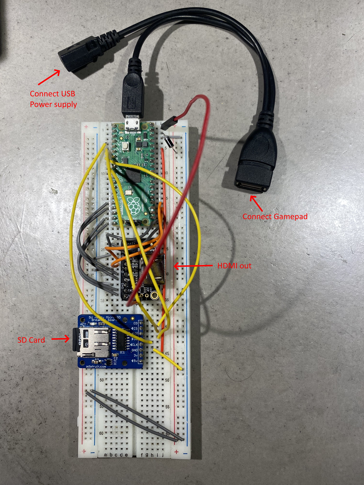

# pico-infonesPlus
A NES Emulator for the Raspberry PI Pico with SD card and menu support. You can use it with the [Pimoroni Pico DV Demo Base](https://shop.pimoroni.com/products/pimoroni-pico-dv-demo-base?variant=39494203998291) hdmi add-on board. 

Alternatively you can use an [Adafruit DVI Breakout For HDMI Source Devices](https://www.adafruit.com/product/4984) and  [Adafruit Micro-SD breakout board+](https://www.adafruit.com/product/254) together with a breadboard.

The emulator used is  [Infones by Jay Kumogata](https://github.com/jay-kumogata/InfoNES) which was ported to the [Raspberry PI Pico by Shuichi Takano](https://github.com/shuichitakano/pico-infones) with changes done by me to accomodate the SD card menu.

In stead of flashing a NES rom to the Pico using picotool, you create a FAT32 formatted SD card and copy your NES roms on to it. It is possible to organise your roms into different folders. Then insert the SD Card into the card slot of the Pimoroni Pico DV Demo base. Needless to say you must own all the roms you put on the card.

A menu is added to the emulator, which reads the roms from the SD card and shows them on screen for the user to select,  flash and play.

Click on image below to see a demo video.

## Warning
Repeatedly flashing your Pico will eventually wear out the flash memory. 

The emulator overclocks the Pico in order to get the emulator working fast enough. Overclocking can reduce the Pico's lifespan.

Use this software at your own risk! I will not be responsible in any way for any damage to your Pico and/or connected peripherals caused by using this software.

I also do not take responsability in any way when damage is caused to the Pico or display due to incorrect wiring or voltages.

## Controller support
The emulator supports these controllers:

- Sony Dual Shock 4
- Sony Dual Sense
- BUFFALO BGC-FC801 (not tested)

## Pico setup (Pimoroni Pico DV Demo Base)

### materials needed
- Raspberry Pi Pico (not W!), with soldered male headers.
- [Pimoroni Pico DV Demo Base](https://shop.pimoroni.com/products/pimoroni-pico-dv-demo-base?variant=39494203998291).
- [Micro usb to usb OTG Cable](https://a.co/d/dKW6WGe)
- Dual Shock 4 or Dual Sense Controller.
- HDMI Cable.
- Micro usb power adapter.
- Micro usb to usb cable when using the Duak Shock 4 controller
- usb C to usb cable when using the Sony Dual Sense controller.
- FAT 32 formatted Micro SD card with roms you legally own. Roms must have the .nes extension. You can organise your roms into different folders.

### flashing the Pico
- Download piconesPlusPimoroniDV.uf2 from the [releases page](https://github.com/fhoedemakers/pico-infonesPlus/releases/latest).
- Push and hold the BOOTSEL button on the Pico, then connect to your computer using a micro usb cable. Release BOOTSEL once the drive RPI-RP2 appears on your computer.
- Drag and drop the UF2 file on to the RPI-RP2 drive. The Raspberry Pi Pico will reboot and will now run the emulator.

### setting up the hardware
- Disconnect the Pico from your computer.
- Attach the Pico to the DV Demo Base.
- Connect the HDMI cable to the Demo base and your monitor.
- Connect the usb OTG cable to the Pico's usb port.
- Connect the controller to the other end of the usb OTG.
- Insert the SD card into the SD card slot.
- Connect the usb power adapter to the usb port of the Demo base.
- Power on the monitor and the Pico

## Alternative Pico setup using Adafruit hardware

### materials needed
- Raspberry Pi Pico (not W!), with soldered male headers.
- [Adafruit DVI Breakout For HDMI Source Devices](https://www.adafruit.com/product/4984)
- [Adafruit Micro-SD breakout board+](https://www.adafruit.com/product/254)
- [Micro usb to OTG Y-Cable](https://a.co/d/b9t11rl)
- Breadboard
- Dual Shock 4 or Dual Sense Controller.
- HDMI Cable.
- Micro usb power adapter.
- usb C t usb cable when using the Sony Dual Sense controller
- Micro usb to usb second cable when using a Dual Shock 4
- FAT 32 formatted Micro SD card with roms you legally own. Roms must have the .nes extension. You can organise your roms into different folders.

### flashing the Pico
- Download piconesPlusAdaFruitDVISD.uf2 from the [releases page](https://github.com/fhoedemakers/pico-infonesPlus/releases/latest).
- Push and hold the BOOTSEL button on the Pico, then connect to your computer using a micro usb cable. Release BOOTSEL once the drive RPI-RP2 appears on your computer.
- Drag and drop the UF2 file on to the RPI-RP2 drive. The Raspberry Pi Pico will reboot and will now run the emulator.

### Pinout

Use the breadboard to connect all together:

- Wire Pico Pin 38 to the breadboard ground column (-)
- Wire the breadboard left ground column (-) with the breadboard right ground column (-)

#### Adafruit Micro-SD breakout board+

|  Breakout     | GPIO   | Pin number     |
| ------------- | ------ | -------------- |
| CS            | GP5    | 7              |
| CLK (SCK)     | GP2    | 4              |
| DI (MOSI)     | GP3    | 5              |
| DO (MISO)     | GP4    | 6              |
| 3V            |        | 36             |
| GND           |        | Ground on breadboard (-) |

#### Adafruit DVI Breakout For HDMI Source Devices

|  Breakout     | GPIO | Pin number |
| ------------- | ---- | ---------- |
| D0+           | GP12 | 16         |
| D0-           | GP13 | 17         |
| CK+           | GP14 | 19         |
| CK-           | GP15 | 20         |
| D2+           | GP16 | 21         |
| D2-           | GP17 | 22         |
| D1+           | GP18 | 24         |
| D1-           | GP19 | 25         |
| 5 (*)         | VBUS | 40 (5volt) |
| GND (3x)      |      | Ground on breadboard (-)     |

(*) This is the via on the side of the board marked 5. (next to via D and C). 

### setting up the hardware

- Disconnect the Pico from your computer.
- Attach the Pico to the breadboard.
- Insert the SD card into the SD card slot.
- Connect the HDMI cable to the Adafruit HDMI Breakout board and to your monitor.
- Connect the usb OTG Y-cable to the Pico's usb port.
- Connect the controller to the full size female usb port of the OTG Y-Cable
- Connect the Micro usb power adapter to the female Micro usb connecter of the OTG Y-Cable.
- Power on the monitor and the Pico

See image below. 
Note. The Shotky Diode (VSYS - Pin 39 to breadboard + column) and the wire on breadboard left (+) to right (+) are not necessary, but recommended when powering the Pico from a Raspberry Pi. 
[See Chapter 4.6 - Powering the Board of the Raspberry Pi Pico Getting Started guide](https://datasheets.raspberrypi.com/pico/getting-started-with-pico.pdf) 

## Menu Usage
Gamepad buttons:
- UP/DOWN: Next/previous item in the menu.
- LEFT/RIGHT: next/previous page.
- A (Circle): Open folder/flash and start game.
- B (X): Back to parent folder.
- START: Starts game currently loaded in flash.

## Emulator 
Gamepad buttons:
- SELECT + START: Resets back to the SD Card menu. Game saves are saved to the SD card.
- SELECT + UP/SELECT + DOWN: switches screen modes.
- SELECT + A/B: toggle rapid-fire.

## Save games
For games which support it, saves will be stored in the /SAVES folder of the SD card. Caution: the save ram will only be saved back to the SD card when quitting the game via (START + SELECT)

## Raspberry Pico W support
The emulator does not work with the Pico W.

## Troubleshooting no image on TV or monitor

- Make sure the board is directly connected to your display. Do not connect through a HDMI splitter.
- When using the Adafruit HDMI board, make sure VBUS (Pin 40) is connected to the 5 volt via  on the board. (Marked 5 on the side) Some displays need 5V in order to work. 

## Known Issues and limitations
- Pimoroni Pico DV: Audio through the audio out jack is not supported, audio only works over hdmi.
- Due to the Pico's memory limitations, not all mappers are supported.
- tar file support is removed.

## Building from source
The emulator and menu system take almost the whole ram. Therefore, the Release build is too big to fit into the Pico's ram, and cannot be used. Also the MinSizeRel (Optimise for smallest binary size) build is not suitable, because it makes the emulator too slow.

Best is to use the included build script [buildAll.sh](https://github.com/fhoedemakers/pico-infonesPlus/blob/main/buildAll.sh). You can then copy the.uf2 to your Pico via the bootsel option. The script builds two .uf2 files (Pimoroni and Adafruit) and puts them in the assets folder.

When using Visual Studio code, choose the RelWithDebInfo or the Debug build variant.

## Acknowledgements
InfoNes is programmed by [Jay Kumogata](https://github.com/jay-kumogata/InfoNES) and ported to the Raspberry PI Pico by [Shuichi Takano](https://github.com/shuichitakano/pico-infones).

I contributed by adding SD card and menu support. For this reasons I made code changes to the emulator for accommodating the menu and SD card.

