# pico-infonesPlus.

## Introduction

**pico-infonesPlus** is a NES (Nintendo Entertainment System) emulator for Raspberry Pi Pico, Pico 2, and other RP2040/RP2350-based microcontrollers. It provides NES emulation with SD card support, an integrated menu system, and HDMI video output, enabling users to build compact, affordable retro gaming systems.

### Features

- **NES Emulation** – Execute NES ROM files directly from an SD card
- **SD Card Menu System** – Browse and launch games from an on-screen menu interface
- **Recently Played List** – The last 20 games you started, one button press away in the menu ([details](#recently-played-games))
- **USB Drive Mode** – Present the SD card to a computer as a USB drive from the settings menu, so games can be added or removed without taking the card out ([details](#usb-drive-mode))
- **Dual Controller Support** – Two simultaneous controllers for multiplayer gameplay ([details](#about-two-player-games))
- **NES Zapper (light gun)** – Beta support in controller port 2 of the [custom PCB](#nes-zapper-light-gun), using LCD-lag-corrected ROM patches and a third-party gun such as the Tomee Zapp Gun
- **Save State Management** – Automatic battery-backed SRAM persistence and manual save states
- **Famicom Disk System** – Support for FDS game images with user-supplied BIOS. More info on this in the [FDS Games](#famicom-disk-system-fds-games-1) section below.
- **Multi-Region Support** – NTSC, PAL, and Dendy region compatibility
- **NSF Audio Playback** – Play NES music files (`.nsf`) with visual VU-meter overlay. More info on this in the [Playing NSF Audio Files](#playing-nsf-audio-files) section below.
- **WAV Audio Playback** – WAV (`.wav`) format audio playback in the menu (RP2350 only). More info on this in the [WAV Music Playback in Menu](#wav-music-playback-in-menu-rp2350-only) section below.
- **Flexible Hardware** – [Compatible with standard DVI/HDMI breakout boards](#possible-configurations), with optional [custom PCB](#pcb-with-raspberry-pi-pico-or-pico-2-and-pimoroni-pico-plus-2) and [3D-printed case](#3d-printed-case-for-pcb)
- **Multi-Emulator Console** – Can run under [pico-bootLoader](#running-under-pico-bootloader) alongside other emulators and Doom, selectable from an on-screen menu (RP2350 only)


### Regional Support

| Platform | NTSC | PAL | Dendy |
|----------|------|-----|-------|
| **RP2350** | ✓ | ✓ (native speed) | ✓ (native speed, untested) |
| **RP2040** | ✓ | ✓ (60Hz) | ✓ (60Hz, untested) |

*Note: RP2040 boards operate PAL/Dendy games at 60Hz instead of 50Hz due to hardware constraints.*

### Setup Overview

1. Prepare an SD card formatted as FAT32 or exFAT
2. Transfer NES ROM files to the card. The file browser starts in `/roms/NES`, so this is the recommended location. If that folder does not exist, the browser falls back to the root of the card. Subfolders are supported.
3. Optionally include [metadata files](#using-metadata) for game information
4. Insert the SD card into the device
5. Use the menu to browse, select, and play games. Save data is automatically persisted to the SD card.

### Famicom Disk System (FDS) Games

To enable FDS game support, provide your own BIOS file:
1. Copy the FDS BIOS file to the `/bios` directory on your SD card
2. Name the file: `fds-bios.rom`

Note that FDS games can only be played on RP2350.

FDS ROM images will then be available alongside NES ROMs in the menu.

For more info on FDS Game see the [FDS](#famicom-disk-system-fds-games-1) section in this README.

### Project Information

This project is based on [Infones](https://github.com/jay-kumogata/InfoNES) by Jay Kumogata, ported to Raspberry Pi Pico by [Shuichi Takano](https://github.com/shuichitakano/pico-infones). This implementation extends the core emulator with comprehensive SD card integration, menu functionality, and additional enhancements.

For detailed setup instructions, refer to the [Setup](#setup) section. For hardware configurations and controller options, consult [Possible Configurations](#possible-configurations) and [Gamecontroller Support](#gamecontroller-support). Additional guidance is available in the [Adafruit tutorial](https://learn.adafruit.com/nes-emulator-for-rp2040-dvi-boards).

There is also an emulator port for the Sega Master System/Sega Game Gear, Nintendo DMG Game Boy/Game Boy Color and Sega Mega Drive/Genesis. You can find them here:

- Sega Master System/Game Gear: [https://github.com/fhoedemakers/pico-smsplus](https://github.com/fhoedemakers/pico-smsplus)
- Nintendo DMG Game Boy and Game Boy Color: [https://github.com/fhoedemakers/pico-peanutGB](https://github.com/fhoedemakers/pico-peanutGB)
- Sega Mega Drive/Genesis: [https://github.com/fhoedemakers/pico-genesisPlus](https://github.com/fhoedemakers/pico-genesisPlus)
- If you have an [Adafruit Fruit Jam](https://www.adafruit.com/product/6200): See this multi emulator project: https://github.com/fhoedemakers/retroJam. Plays NES, Game Boy, Game Boy Color, Sega Master System, Sega Game Gear and Sega Genesis.
- On any supported RP2350 board, [pico-bootLoader](https://github.com/fhoedemakers/pico-bootLoader) lets you install this emulator next to the ones above and pick between them from an on-screen menu. See [Running under pico-bootLoader](#running-under-pico-bootloader).

***

## Video
Click on image below to see a demo video.

[](https://www.youtube.com/watch?v=OEcpNMNzZCQ)

***

## Possible configurations

You can use it with these RP2040/RP2350 boards and configurations:
    
  - [A custom printed circuit board (PCB)](#pcb-with-raspberry-pi-pico-or-pico-2-and-pimoroni-pico-plus-2) designed by [@johnedgarpark](https://twitter.com/johnedgarpark). (requires soldering) Up to two NES controller ports can be added to this PCB. Can also be used with a USB game controller. You can 3D print your own NES-like case for the PCB. The current design (v2.6) has through-holes, so besides a Raspberry Pi Pico or Pico 2 you can also use a Pimoroni Pico Plus 2, as long as it has soldered male headers.
    
  - [An additional PCB design for Waveshare RP2040 & RP2350 Zero including case design by DynaMight1124](#pcb-with-waveshare-rp2040rp2350-zero) based around cheaper but harder to solder components for those that fancy a bigger challenge. It also allows the design to be smaller.

  - [A further PCB design has also been created for the new Waveshare RP2350 USB A board](#pcb-with-waveshare-rp2350-usb-a), this allows a very small PicoNES console to be made using USB control pads only. By far the most challenging to solder, if that's your thing!
 
- [Adafruit Feather RP2040 with DVI](https://www.adafruit.com/product/5710) (HDMI) Output Port. For use with a USB game controller, up to two legacy NES controllers, or even a Wii Classic controller. Requires these add-ons:
  - Breadboard
  - SD reader  (choose one below)
    - [Adafruit Micro-SD breakout board+](https://www.adafruit.com/product/254).
    - [FeatherWing - RTC + SD](https://www.adafruit.com/product/2922). (not tested by me, but should work)
   
- [Waveshare RP2040-PiZero Development Board](https://www.waveshare.com/rp2040-pizero.htm)

  For use with a USB game controller, up to two legacy NES controllers, or a Wii Classic controller. (No soldering required)

  You can 3D print your own NES-like case for this board. This does require some soldering.

- [Waveshare RP2350-PiZero Development Board](https://www.waveshare.com/rp2350-pizero.htm) Supports the optional PSRAM chip. When installed, the emulator loads ROMs from PSRAM instead of flash memory for significantly faster performance. Boards that combine PSRAM with a non-Winbond flash chip need a one-time fix first, see [PSRAM with a non-Winbond flash chip](#psram-with-a-non-winbond-flash-chip). Fully functional even without PSRAM.

- [Adafruit Metro RP2350](https://www.adafruit.com/product/6003) Supports the optional PSRAM chip. When installed, the emulator loads ROMs from PSRAM instead of flash memory for significantly faster performance. Fully functional even without PSRAM.

- [Pimoroni Pico Plus 2](https://shop.pimoroni.com/products/pimoroni-pico-plus-2?variant=42092668289107)

  Can be used in three ways:
  - On a breadboard with the [Adafruit DVI Breakout For HDMI Source Devices](https://www.adafruit.com/product/4984) and the [Adafruit Micro-SD breakout board+](https://www.adafruit.com/product/254). For use with a USB game controller or up to two legacy NES controllers. (No soldering required)
  - On the [custom PCB](#pcb-with-raspberry-pi-pico-or-pico-2-and-pimoroni-pico-plus-2), from design v2.6 onwards, provided male headers are soldered onto it.
  - On the discontinued [Pimoroni Pico DV Demo Base](https://shop.pimoroni.com/products/pimoroni-pico-dv-demo-base?variant=39494203998291) HDMI add-on board. For use with a USB game controller or up to two legacy NES controllers. (NES controller ports require soldering)
  
  The PSRAM on the board is used instead of flash to load the ROMs from SD.

- [Adafruit Fruit Jam](https://www.adafruit.com/product/6200)
No additional hardware is required apart from a USB gamepad. Audio is output through the monitor or the included speaker, with the option to connect external speakers and a Wii Classic controller via STEMMA QT. The PSRAM on the board is used instead of flash to load the ROMs from SD.

- [SpotPear HDMI](https://spotpear.com/index/product/detail/id/1207.html)
See the downloads on the releases page for the correct binary to use with this board.

- [Murmulator M1 and M2 boards](https://murmulator.ru).
See the downloads on the releases page for the correct binary to use with these boards.

[See below to see how to set up your specific configuration.](#setup)


***

## Gamecontroller support
Depending on the hardware configuration, the emulator supports these game controllers. In some configurations, a USB-Y cable is needed to both connect power and a game controller to the USB port.

### USB  game Controllers
- Sony Dual Shock 4
- Sony Dual Sense
- BUFFALO BGC-FC801 connected to USB - not tested
- Genesis Mini 1 and 2
- [Retro-bit 8 button Genesis-USB](https://www.retro-bit.com/controllers/genesis/#usb)
- PlayStation Classic
- Keyboard
- XInput type of controllers like Xbox 360 and Xbox One controllers and other XInput compatible controllers like 8bitDo.
- Mantapad, cheap [NES](https://nl.aliexpress.com/w/wholesale-nes-controller-usb.html?spm=a2g0o.home.search.0) and [SNES](https://nl.aliexpress.com/w/wholesale-snes-controller-usb.html?spm=a2g0o.productlist.search.0) USB controllers from AliExpress. Although cheap and working i do not recommended them.

See also [troubleshooting USB controllers below](#troubleshooting-usb-controllers)

>[!NOTE]
> There is some input lag when using USB controllers.

#### Optional Second USB-Port for game controller use.
In some configurations, a second USB port is available for connecting a USB game controller. The built-in USB port remains dedicated to power and firmware flashing, so there is no need for a USB-Y cable.

This feature is enabled by default on the Adafruit Fruit Jam, the Waveshare RP2350-PiZero and the Waveshare RP2350-USB A. For other boards, you’ll need to [build the firmware from source](#building-from-source) to enable it, as the pre-built binaries do not include this option.

For more info, see [pio_usb.md](pio_usb.md).

### Legacy controllers
- One or optionally two original NES controllers for two player games.  In some configurations, soldering is required.
- Original SNES controllers can be connected to the NES controller port(s) as well. The emulator detects automatically whether an NES or a SNES controller is attached, so no configuration is needed.
- Wii Classic controller: Adafruit Feather RP2040, WaveShare RP2040 Pi-Zero, Adafruit Metro RP2350, Adafruit Fruit Jam boards only
- NES Zapper (light gun): [custom PCB](#nes-zapper-light-gun) design v2.1 or later only, in controller port 2. Not available on the other configurations - GPIO27 and GPIO28 are already in use there, and the Murmulator M1/M2 boards leave the controller ports' D3 and D4 unconnected altogether. Needs LCD-lag-corrected ROM patches **and** a third-party gun such as the Tomee Zapp Gun; an original Nintendo Zapper does not work on a flat panel without a hardware modification. See the [NES Zapper](#nes-zapper-light-gun) section.
      
Parts list for legacy controllers
  * NES or SNES controller. A second controller port and controller is optional and only needed if you want to play two player games using legacy controllers. Two player games can also be played with a USB controller and a legacy controller.
    * [NES controller port](https://www.zedlabz.com/products/controller-connector-port-for-nintendo-nes-console-7-pin-90-degree-replacement-2-pack-black-zedlabz)
    * [An original NES controller](https://www.amazon.com/s?k=NES+controller&crid=1CX7W9NQQDF8H&sprefix=nes+controller%2Caps%2C174&ref=nb_sb_noss_1)

  * Wii Classic controller 
    *  [Adafruit Wii Nunchuck Breakout Adapter - Qwiic / STEMMA QT](https://www.adafruit.com/product/4836)
    *  Adafruit Feather RP2040: [Adafruit STEMMA QT / Qwiic JST SH 4-pin Cable](https://www.adafruit.com/product/4210)
    *  Waveshare RP2040-PiZero Development Board: [STEMMA QT / Qwiic JST SH 4-pin Cable with Premium Female Sockets](https://www.adafruit.com/product/4397)
    *  [Wii Classic wired controller](https://www.amazon.com/s?k=wii-classic+controller)

***

## About two player games

The emulator supports two player games using two NES controllers, two USB gamepads connected via a USB hub, or a USB gamepad combined with a NES controller.

When using a USB hub with a Raspberry Pi Pico, you need an OTG USB-Y cable to connect both power and the hub. On the Adafruit Fruit Jam, two USB gamepads can be connected directly to the two USB ports without a hub.

> [!NOTE]
> USB hub support for two gamepads has been tested on Raspberry Pi Pico and Pico 2 configurations. Not all setups are supported — for example, a USB hub connected to the PIO USB port of the Waveshare RP2350-PiZero does not work.

| | Player 1 | Player 2 |
| --- | -------- | -------- |
| Two USB gamepads connected (via USB hub) | USB 1 | USB 2 |
| One USB gamepad connected | USB | NES port 1 or NES port 2 |
| No USB gamepad connected | NES port 1| NES port 2 |


***
## PSRAM
Some boards support additional memory called PSRAM, with a capacity of up to 8 MB. On certain boards this comes pre-installed, while on others it is optional and must be soldered manually. The emulator detects the PSRAM and its size at boot and will automatically make use of it.

Without PSRAM, selecting a game ROM triggers a reboot: the ROM is written to flash memory during startup to prevent the system from locking up. This process is relatively slow, taking several seconds before the game starts.

Starting the game that is already in flash is quick, though: the emulator remembers which ROM it wrote there and skips the write when you select that same game again. It still reboots, but without the several seconds of flashing. In the [recently played list](#recently-played-games) that game is tagged **[READY]**.

With PSRAM, this step is no longer needed. Games are loaded directly from the SD card into PSRAM and executed immediately, resulting in much faster startup times.


| Board | PSRAM Included |
|:--|:--|
| [Waveshare RP2350-PiZero](https://www.waveshare.com/rp2350-pizero.htm) | No – optional, must be soldered ([PSRAM module](https://www.adafruit.com/product/4677)). See [PSRAM with a non-Winbond flash chip](#psram-with-a-non-winbond-flash-chip) |
| [Adafruit Metro RP2350 with PSRAM](https://www.adafruit.com/product/6267) | Yes – pre-installed |
| [Pimoroni Pico Plus 2](https://shop.pimoroni.com/products/pimoroni-pico-plus-2) | Yes – pre-installed |
| [Adafruit Fruit Jam](https://www.adafruit.com/product/6200) | Yes - pre-installed |

## PSRAM with a non-Winbond flash chip

Some RP2350 boards, notably the Waveshare RP2350-PiZero, ship with a flash chip from a manufacturer other than Winbond, such as Puya. On those chips the Quad Enable (QE) bit in Status Register 2 is not set from the factory. In combination with PSRAM this makes the board lock up when the RP2350 is overclocked, which is what the emulator does. See issue [#191](https://github.com/fhoedemakers/pico-infonesPlus/issues/191).

Boards **without** PSRAM are not affected.

This can be fixed permanently, once, with the [flash_config](https://github.com/fhoedemakers/flash_config) tool:

1. Download the prebuilt **[FLASH_QE_SET_1.uf2](https://github.com/fhoedemakers/flash_config/blob/main/uf2/FLASH_QE_SET_1.uf2)** from the [uf2 folder](https://github.com/fhoedemakers/flash_config/tree/main/uf2) of that repository, or build it yourself from source.
2. Put the board into BOOTSEL mode and copy the UF2 onto the RPI-RP2 drive.
3. The program sets the QE bit and prints the flash status registers over USB serial.
4. Flash the emulator firmware as usual. The fix is permanent and does not need to be repeated.

> [!CAUTION]
> Do not apply `FLASH_QE_SET_1.uf2` a second time. A repeat run fails and the board then has to be recovered by erasing the flash with `universal_flash_nuke.uf2` first.

> [!NOTE]
> Even after the fix, boards with a non-Winbond flash chip are limited to 252 MHz. This means the **Overclock** setting (378 MHz) cannot be used on them, and therefore neither can the VRC7 FM audio of *Lagrange Point (JP)*, which depends on it.


***

## Warning

The emulator overclocks the Pico in order to get the emulator working fast enough. Overclocking can reduce the Pico's lifespan.

Use this software at your own risk! I will not be responsible in any way for any damage to your Pico and/or connected peripherals caused by using this software.

I also do not take responsibility in any way when damage is caused to the Pico or display due to incorrect wiring or voltages.

***

# Setup

Click on the link below for your specific board configuration:


- [Raspberry Pi Pico or Pico 2, setup with Adafruit hardware and breadboard](#raspberry-pi-pico-or-pico-2-setup-with-adafruit-hardware-and-breadboard)
- [Pimoroni Pico Plus 2](#raspberry-pi-pico-or-pico-2-setup-with-adafruit-hardware-and-breadboard)
- [Adafruit Feather RP2040 with DVI (HDMI) Output Port setup](#adafruit-feather-rp2040-with-dvi-hdmi-output-port-setup)
- [Adafruit Metro RP2350](#adafruit-metro-rp2350)
- [Adafruit Fruit Jam](#adafruit-fruit-jam)
- [Waveshare RP2040-PiZero Development Board](#waveshare-rp2040rp2350-pizero-development-board)
  * [3D printed case for this board](#3d-printed-case-for-rp2040rp2350-pizero)
- [Waveshare RP2350-PiZero Development Board](#waveshare-rp2040rp2350-pizero-development-board)
  * [3D printed case for this board](#3d-printed-case-for-rp2040rp2350-pizero)
- [Printed Circuit Board (PCB) for Raspberry Pi Pico, Pico 2 or Pimoroni Pico Plus 2](#pcb-with-raspberry-pi-pico-or-pico-2-and-pimoroni-pico-plus-2)
  * [NES Zapper (light gun)](#nes-zapper-light-gun)
  * [3D printed case for this PCB](#3d-printed-case-for-pcb)
- [PCB with WaveShare RP2040/RP2350 Zero](#pcb-with-waveshare-rp2040rp2350-zero)
  * [3D printed case for this PCB](#3d-printed-case)
- [PCB with WaveShare RP2350 USB A](#pcb-with-waveshare-rp2350-usb-a)
  * [Build Guide](#build-guide)
- (Discontinued) [Raspberry Pi Pico or Pico 2, setup for Pimoroni Pico DV Demo Base](#raspberry-pi-pico-or-pico-2-setup-for-pimoroni-pico-dv-demo-base)

The SpotPear HDMI board and the Murmulator M1/M2 boards are supported as well, but have no setup section here. Flash `piconesPlus_SpotpearHDMI_pico_arm.uf2` / `piconesPlus_SpotpearHDMI_pico2_arm.uf2`, or `piconesPlus_MurmulatorM1_pico_arm.uf2` / `piconesPlus_MurmulatorM1_pico2_arm.uf2` / `piconesPlus_MurmulatorM2_arm.uf2` from the [releases page](https://github.com/fhoedemakers/pico-infonesPlus/releases/latest) and wire the board according to its own documentation.

> [!NOTE]
> Several boards also have a RISC-V build available (file names ending in `_riscv`). These are functionally identical to the ARM builds; use the ARM build unless you specifically want to run the RISC-V cores of the RP2350.

***

##  Raspberry Pi Pico or Pico 2, setup for Pimoroni Pico DV Demo Base.

> [!NOTE]
> This board is discontinued and no longer sold by Pimoroni

### materials needed
- Raspberry Pi Pico, Pico 2 or [Pimoroni Pico Plus 2](https://shop.pimoroni.com/products/pimoroni-pico-plus-2?variant=42092668289107) with soldered male headers.
- [Pimoroni Pico DV Demo Base](https://shop.pimoroni.com/products/pimoroni-pico-dv-demo-base?variant=39494203998291).
- [Micro usb to usb OTG Cable](https://a.co/d/dKW6WGe)
- Controllers (Depending on what you have)
  - Dual Shock 4 or Dual Sense Controller.
  - one or two NES Controllers.
    - [NES controller port](https://www.zedlabz.com/products/controller-connector-port-for-nintendo-nes-console-7-pin-90-degree-replacement-2-pack-black-zedlabz). Requires soldering.
    - [An original NES controller](https://www.amazon.com/s?k=NES+controller&crid=1CX7W9NQQDF8H&sprefix=nes+controller%2Caps%2C174&ref=nb_sb_noss_1)
    - Optional: A second NES controller port and controller if you want to play two player games.
    - [Dupont wires](https://a.co/d/cJVmnQO)
    - [Male or female headers to be soldered on the board](https://a.co/d/dSNPuyo)
- HDMI Cable.
- Micro USB power adapter.
- Micro USB to USB cable when using the DualShock 4 controller
- USB C to USB data cable when using the Sony DualSense controller.
- FAT32 or exFAT formatted Micro SD card with ROMs you legally own. ROMs must have the .nes extension. You can organise your ROMs into different folders.

> [!NOTE]
> An external speaker can be connected to the audio jack of the Pimoroni Pico DV Demo Base. You can toggle audio output to this jack with SELECT + LEFT. 

### flashing the Pico
- When using a Pico / Pico W, download **[piconesPlus_PimoroniDVI_pico_arm.uf2](https://github.com/fhoedemakers/pico-infonesPlus/releases/latest/download/piconesPlus_PimoroniDVI_pico_arm.uf2)**  from the [releases page](https://github.com/fhoedemakers/pico-infonesPlus/releases/latest).
- When using a Pico 2 or Pico 2 W or Pimoroni Pico Plus 2, download **[piconesPlus_PimoroniDVI_pico2_arm.uf2](https://github.com/fhoedemakers/pico-infonesPlus/releases/latest/download/piconesPlus_PimoroniDVI_pico2_arm.uf2)** from the [releases page](https://github.com/fhoedemakers/pico-infonesPlus/releases/latest).
- Push and hold the BOOTSEL button on the Pico, then connect to your computer using a micro USB cable. Release BOOTSEL once the drive RPI-RP2 appears on your computer.
- Drag and drop the UF2 file on to the RPI-RP2 drive. The Raspberry Pi Pico will reboot and will now run the emulator.

### Pinout

#### NES controller port(s) (if you want to use legacy NES controllers).


|          | Port 1 | Port 2 (optional) |Note  |
| ------------- | ------------- | ------------- | ----------- |
| GND           |               |               | GND (- on board) |
| VCC (Power)   |               |               | Connect to 3V3  |
| NES Clock     | GPIO14        |    GPIO1      |             | 
| NES LATCH     | GPIO16        |    GPIO20     |             |
| NES Data      | GPIO15         |   GPIO21     |             |

> [!NOTE]
> Soldering is required.
> There is only one 3v3 pin header on the board, the other 3V3 must be soldered directly onto pin 36 (3V3 OUT) of the Pico.
> For GND there are two pin headers available on the board.
> Clock Data and Latch for NES controller port 1 must be soldered directly onto the Pico.
> The Clock, Data and Latch for NES controller port 2 can be soldered on the available pin headers on the board, no need to solder them directly onto the Pico.


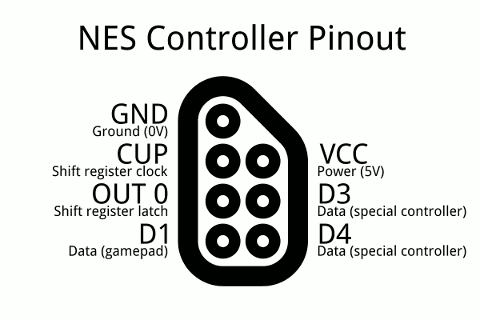

> [!NOTE]
> An original SNES controller can be wired to the same pins. The emulator detects automatically whether an NES or a SNES controller is attached.

### setting up the hardware
- Disconnect the Pico from your computer.
- Attach the Pico to the DV Demo Base.
- Connect the HDMI cable to the Demo base and your monitor.
- Connect the USB OTG cable to the Pico's USB port.
- Depending which controller you want to use:
  - Connect the controller to the other end of the USB OTG cable.
  - Connect legacy NES controller(s) to NES controller port(s).
- Insert the SD card into the SD card slot.
- Connect the USB power adapter to the USB port of the Demo base. (USB POWER)
- Power on the monitor and the Pico

### Image: USB controller only

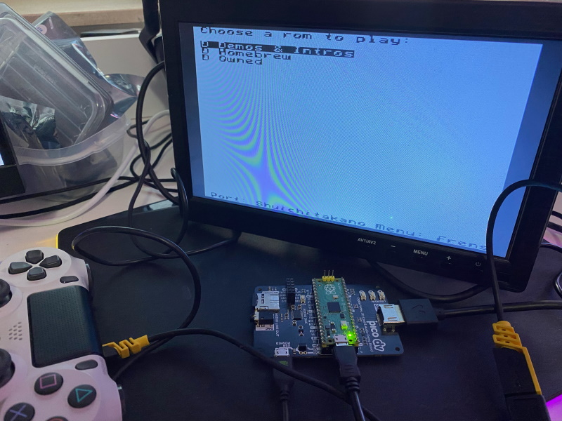

### Image: one or two player setup with USB controller and NES controller port 2

In this image the NES controller port is wired to port 2.

For single player games: use USB controller. 

For two player games: Connect a USB controller for player 1 and a NES controller for player 2 or connect a USB hub with two USB gamepads.

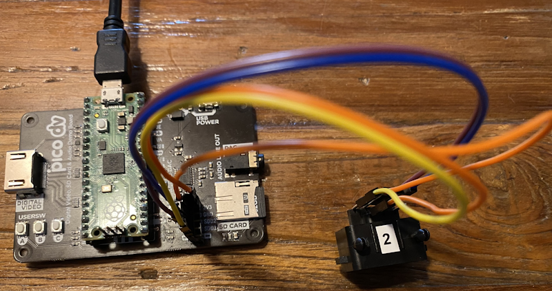

### Two player setup using two NES controllers or a USB controller and a NES controller

Controller port 1 pins must be soldered directly onto the Pico.

Controller port 2 pins can be soldered to the available headers of the Pimoroni DV. 

For two player games: 

- Connect two NES controllers or
- Connect a USB controller for player 1 and a NES controller for player 2. You can use either NES controller ports.

***

## Raspberry Pi Pico or Pico 2, setup with Adafruit hardware and breadboard

> [!NOTE]
> Instead of a Raspberry Pi Pico, you can also use a [Pimoroni Pico Plus 2](https://shop.pimoroni.com/products/pimoroni-pico-plus-2?variant=42092668289107)

### materials needed
- Raspberry Pi Pico or Pico 2 with soldered male headers.
- [Adafruit DVI Breakout For HDMI Source Devices](https://www.adafruit.com/product/4984)
- [Adafruit Micro-SD breakout board+](https://www.adafruit.com/product/254)
- [Micro USB to OTG Y-Cable](https://a.co/d/b9t11rl)
- [Breadboard](https://www.amazon.com/s?k=breadboard&crid=1E5ZFUFWE6HNI&sprefix=breadboard%2Caps%2C167&ref=nb_sb_noss_2)
- [Breadboard jumper wires](https://a.co/d/2NoWOgK)
- Controllers (Depending on what you have)
  - one or two NES controllers.
    - [NES controller port](https://www.zedlabz.com/products/controller-connector-port-for-nintendo-nes-console-7-pin-90-degree-replacement-2-pack-black-zedlabz)
    - [An original NES controller](https://www.amazon.com/s?k=NES+controller&crid=1CX7W9NQQDF8H&sprefix=nes+controller%2Caps%2C174&ref=nb_sb_noss_1)
    - [Dupont male to female wires](https://a.co/d/cJVmnQO)
  - DualShock 4 or DualSense Controller.
- HDMI Cable.
- Micro USB power adapter.
- USB C to USB cable when using the Sony DualSense controller.
- Micro USB to USB cable when using a DualShock 4.
- FAT32 or exFAT formatted Micro SD card with ROMs you legally own. ROMs must have the .nes extension. You can organise your ROMs into different folders.


### flashing the Pico
- When using a Pico / Pico W, download **[piconesPlus_AdafruitDVISD_pico_arm.uf2](https://github.com/fhoedemakers/pico-infonesPlus/releases/latest/download/piconesPlus_AdafruitDVISD_pico_arm.uf2)** / **[piconesPlus_AdafruitDVISD_pico_w_arm.uf2](https://github.com/fhoedemakers/pico-infonesPlus/releases/latest/download/piconesPlus_AdafruitDVISD_pico_w_arm.uf2)** from the [releases page](https://github.com/fhoedemakers/pico-infonesPlus/releases/latest).
- When using a Pico 2 or Pico 2 W, download **[piconesPlus_AdafruitDVISD_pico2_arm.uf2](https://github.com/fhoedemakers/pico-infonesPlus/releases/latest/download/piconesPlus_AdafruitDVISD_pico2_arm.uf2)** / **[piconesPlus_AdafruitDVISD_pico2_w_arm.uf2](https://github.com/fhoedemakers/pico-infonesPlus/releases/latest/download/piconesPlus_AdafruitDVISD_pico2_w_arm.uf2)** from the [releases page](https://github.com/fhoedemakers/pico-infonesPlus/releases/latest).
- Push and hold the BOOTSEL button on the Pico, then connect to your computer using a micro USB cable. Release BOOTSEL once the drive RPI-RP2 appears on your computer. Or, when the board is already powered on, press and hold BOOTSEL, then press RUN on the board.
- Drag and drop the UF2 file on to the RPI-RP2 drive. The Raspberry Pi Pico will reboot and will now run the emulator.

### Pinout 

See https://www.raspberrypi.com/documentation/microcontrollers/images/pico-pinout.svg for the pinout schema of the Raspberry Pi Pico.

Use the breadboard to connect all together:

- Wire Pico Pin 38 to the breadboard ground column (-)
- Wire the breadboard left ground column (-) with the breadboard right ground column (-)

#### Adafruit Micro-SD breakout board+

|  Breakout     | GPIO   | Note     |
| ------------- | ------ | -------------- |
| CS            | GPIO5    |               |
| CLK (SCK)     | GPIO2    |               |
| DI (MOSI)     | GPIO3    |               |
| DO (MISO)     | GPIO4    |               |
| 3V            |        | Pin 36 (3v3 OUT)            |
| GND           |        | Ground on breadboard (-) |

#### Adafruit DVI Breakout For HDMI Source Devices

|  Breakout     | GPIO | Note|
| ------------- | ---- | ---------- |
| D0+           | GPIO12 |         |
| D0-           | GPIO13 |         |
| CK+           | GPIO14 |         |
| CK-           | GPIO15 |         |
| D2+           | GPIO16 |         |
| D2-           | GPIO17 |         |
| D1+           | GPIO18 |         |
| D1-           | GPIO19 |         |
| 5 (*)         | VBUS | Pin 40 (5volt) |
| GND (3x)      |      | Ground on breadboard (-)     |

(*) This is the via on the side of the board marked 5. (next to via D and C). 

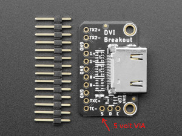

#### NES controller port(s). (if you want to use legacy NES controllers).
|           | Port1 | Port 2 (optional) | Note |
| ------------- | ---- | -------- |---------- |
| GND           |      | | |Ground on breadboard (-) |
| VCC (Power)   |      |   |(3v3 OUT)        |
| NES Clock     | GPIO6  | GPIO9 |          |
| NES LATCH     | GPIO8  | GPIO11 |          |
| NES Data      | GPIO7  | GPIO10 |          |


> [!NOTE]
> An original SNES controller can be wired to the same pins. The emulator detects automatically whether an NES or a SNES controller is attached.

### setting up the hardware

- Disconnect the Pico from your computer.
- Attach the Pico to the breadboard.
- Insert the SD card into the SD card slot.
- Connect the HDMI cable to the Adafruit HDMI Breakout board and to your monitor.
- Connect the USB OTG Y-cable to the Pico's USB port.
- Connect the Micro USB power adapter to the female Micro USB connector of the OTG Y-Cable.
- Controllers (Depending on what you have)
  - Connect the USB controller to the full size female USB port of the OTG Y-Cable.
  - Connect your NES controller(s) to the NES controller port(s).
- Power on the monitor and the Pico

See image below. 

> [!NOTE]
> The Schottky diode (VSYS - Pin 39 to breadboard + column) and the wire on breadboard left (+) to right (+) are not necessary, but recommended when powering the Pico from a Raspberry Pi.
> [See Chapter 4.6 - Powering the Board of the Raspberry Pi Pico Getting Started guide](https://datasheets.raspberrypi.com/pico/getting-started-with-pico.pdf) 

### Image: one or two player setup with USB controller and NES controller port

In this image the NES controller port is wired to port 1.

For single player games, connect either a USB controller **or** a NES controller. Not both!

For two player games: Connect a USB controller for player 1 and a NES controller for player 2.

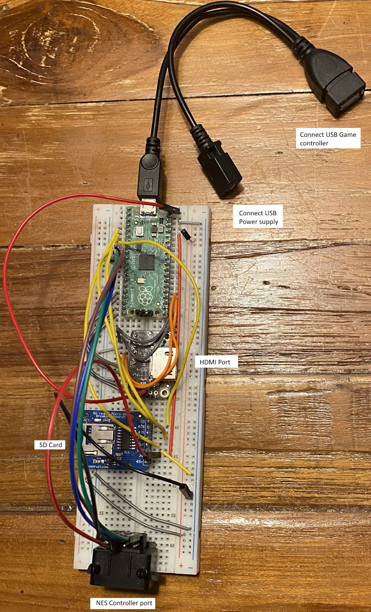

### Image: Two player setup using two NES controllers or a USB controller and a NES controller

Choose either of the following:

- Connect two NES controllers 
- Connect a USB controller for player 1 and a NES controller for player 2. You can use either NES controller ports.

> [!NOTE]
> The device on the left is a Pico Debug probe used for debugging. This is optional

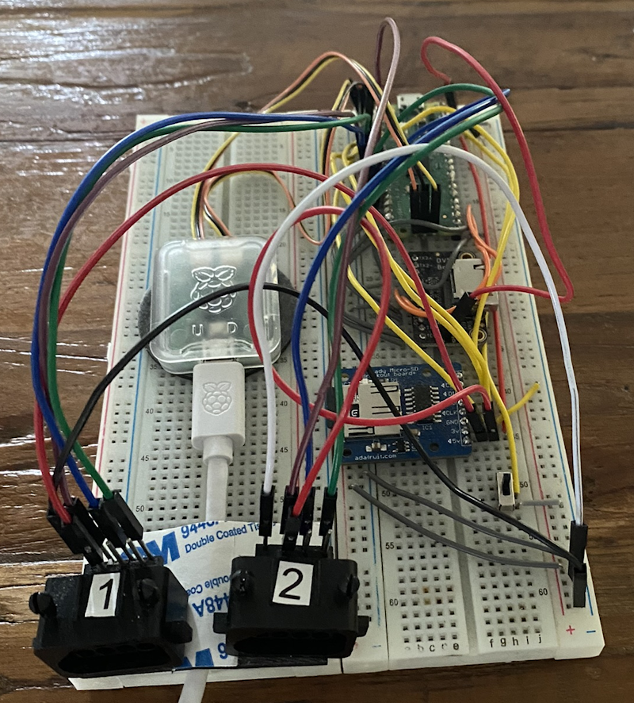

***

##  Adafruit Feather RP2040 with DVI (HDMI) Output Port setup

### materials needed

- [Adafruit Feather RP2040 with DVI (HDMI) Output Port](https://www.adafruit.com/product/5710)
- SD Reader (Choose one below)
  * [Adafruit Micro-SD breakout board+](https://www.adafruit.com/product/254) together with a breadboard.
  * [FeatherWing - RTC + SD](https://www.adafruit.com/product/2922) - not tested by me, but should work.
- [Breadboard](https://www.amazon.com/s?k=breadboard&crid=1E5ZFUFWE6HNI&sprefix=breadboard%2Caps%2C167&ref=nb_sb_noss_2)
- [Breadboard jumper wires](https://a.co/d/2NoWOgK)
- USB-C to USB data cable.
- HDMI Cable.
- FAT32 or exFAT formatted Micro SD card with ROMs you legally own. ROMs must have the .nes extension. You can organise your ROMs into different folders.
- Optional: a push button like [this](https://www.kiwi-electronics.com/nl/drukknop-12mm-10-stuks-403?country=NL&utm_term=403&gclid=Cj0KCQjwho-lBhC_ARIsAMpgMoeZIyZD1ZW5GKC0r7iTBCxEP84dIZLqFfoup1D0XNOnpevkp06oyDoaAojJEALw_wcB).

When using a USB game controller this is needed:
- [USB C male to micro USB female cable](https://www.amazon.com/Adapter-Connector-Charging-Compatible-Z3-Black/dp/B07Z9FLJG3/ref=sr_1_5?keywords=usb+c+male+to+micro+usb+female&qid=1688473279&sprefix=usb+c+male+to+micro+%2Caps%2C159&sr=8-5)
- [Micro USB to OTG Y-Cable](https://a.co/d/b9t11rl)
- Micro USB power adapter
- USB C to USB cable when using the Sony DualSense controller.
- Micro USB to USB cable when using a DualShock 4.

When using legacy controllers, this is needed:
  * USB-C Power supply   
  * Depending on what you have:
    * one or two NES Controllers.
      * [NES controller port](https://www.zedlabz.com/products/controller-connector-port-for-nintendo-nes-console-7-pin-90-degree-replacement-2-pack-black-zedlabz)
      * [An original NES controller](https://www.amazon.com/s?k=NES+controller&crid=1CX7W9NQQDF8H&sprefix=nes+controller%2Caps%2C174&ref=nb_sb_noss_1)
      * [Dupont male to female wires](https://a.co/d/cJVmnQO)
    * Wii Classic controller
      *  [Adafruit Wii Nunchuck Breakout Adapter - Qwiic / STEMMA QT](https://www.adafruit.com/product/4836)
      *  [Adafruit STEMMA QT / Qwiic JST SH 4-pin Cable](https://www.adafruit.com/product/4210)
      *  [Wii Classic wired controller](https://www.amazon.com/Classic-Controller-Nintendo-Wii-Remote-Console/dp/B0BYNHWS1V/ref=sr_1_1_sspa?crid=1I66OX5L05507&keywords=Wired+WII+Classic+controller&qid=1688119981&sprefix=wired+wii+classic+controller%2Caps%2C150&sr=8-1-spons&sp_csd=d2lkZ2V0TmFtZT1zcF9hdGY&psc=1)
  
### Pinout 
See: https://learn.adafruit.com/assets/119662 for the Feather pin scheme.

Use the breadboard to connect all together:

- Wire the 3.3V Pin to the breadboard + column.
- Wire the GND Pin to the breadboard - column
- Wire the breadboard left ground column (-) with the breadboard right ground column (-)
- Optional: Attach a push button to the breadboard and connect a wire from this button to the Feather RST pin and breadboard ground column(-). This adds an extra easy to access Reset button.

#### Adafruit Micro-SD breakout board+

|  Breakout     | GPIO   |      |
| ------------- | ------ | -------------- |
| CS            | GPIO10    |              |
| CLK (SCK)     | GPIO14    |               |
| DI (MOSI)     | GPIO15   |               |
| DO (MISO)     | GPIO8   |               |
| 5V            | USB     | pin labelled USB on feather       |
| 3V            |        | See Note below
| GND           |        | - column on breadboard connected to feather ground pin|

> [!NOTE]
> The Adafruit Micro-SD breakout board+ also has a 3V input pin which can be connected to the + column on the breadboard connected to the feather 3.3V pin. However, this frequently gave me errors trying to mount the SD card. So use 5V instead.

#### Wii nunchuck breakout adapter.

Connect the nunchuck breakout adapter to the Feather DVI using the STEMMA QT cable.

#### NES controller port(s). (if you want to use legacy NES controllers).

|               | Port 1 | Port 2 (optional) | Note |
| ------------- | ---- | ------ | ---------- |
| GND           |      | | - column on breadboard connected to feather ground pin |
| VCC (Power)   |      | | + column on breadboard connected to feather 3.3V pin         |
| NES Clock     | GPIO5 | GPIO26 |          |
| NES LATCH     | GPIO9 | GPIO27 |        |
| NES Data      | GPIO6 | GPIO28 |        |


> [!NOTE]
> An original SNES controller can be wired to the same pins. The emulator detects automatically whether an NES or a SNES controller is attached.

### flashing the Feather RP2040
- Download **[piconesPlus_AdafruitFeatherDVI_arm.uf2](https://github.com/fhoedemakers/pico-infonesPlus/releases/latest/download/piconesPlus_AdafruitFeatherDVI_arm.uf2)** from the [releases page](https://github.com/fhoedemakers/pico-infonesPlus/releases/latest).
- Connect the feather to a USB port on your computer using the USB-C data cable.
- On the feather, push and hold the BOOTSEL button, then press RESET. Release the buttons, the drive RPI-RP2 should appear on your computer.
- Drag and drop the UF2 file on to the RPI-RP2 drive. The Raspberry Pi Pico will reboot and will now run the emulator.

> [!NOTE]
>  When the emulator won't start after flashing or powering on, and the screen shows 'No signal,' press the reset button once again. The emulator should now boot.

### setting up the hardware

- Disconnect the Pico from your computer.
- Attach the Adafruit Feather RP2040 DVI to the breadboard.
- Insert the SD card into the SD card slot.
- Connect the HDMI cable to the HDMI port of the Adafruit Feather and to your monitor.
- Connect controllers depending on your setup:
  - Legacy controllers.
    - NES controller to the NES controller port.
    - Wii Classic controller to the Nunchuck Breakout Adapter.
    - Connect USB-C power supply to USB-C connector.
  - USB game controllers
    * Connect the USB C connector of the "male USB C to female micro USB cable" to the USB C port of the feather.
    * Connect the female micro USB port of the "male USB C to female micro USB cable" to the male micro USB port of the USB OTG Y cable.
    * Connect the DualSense or DualShock controller with the appropriate cable to the full size female USB port of the OTG Y-Cable.
    * Connect the Micro USB power adapter to the female Micro USB connector of the OTG Y-Cable.
- Power on the monitor and the Pico

### Image: one or two player setup with USB controller and NES/Wii Classic controller port

In this image the NES controller port is wired to port 1.

For single player games, connect either a USB controller **or** a NES/Wii Classic controller. Not both!

For two player games: Connect a USB controller for player 1 and a NES or Wii Classic controller for player 2.

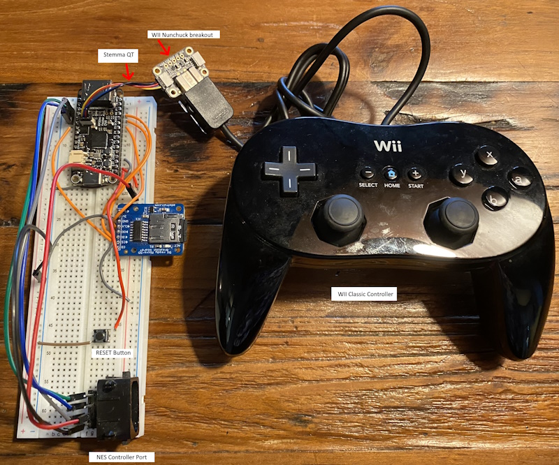

### Image: Two player setup using two NES controllers or a USB controller and a NES/Wii Classic controller

Choose either of the following:

- Connect two NES controllers
- Connect a Wii Classic controller for player 1 and a NES controller on port 2 for player 2
- Connect a USB controller for player 1 and a NES controller for player 2. You can use either NES controller ports. You can also use the Wii Classic controller for player 2.


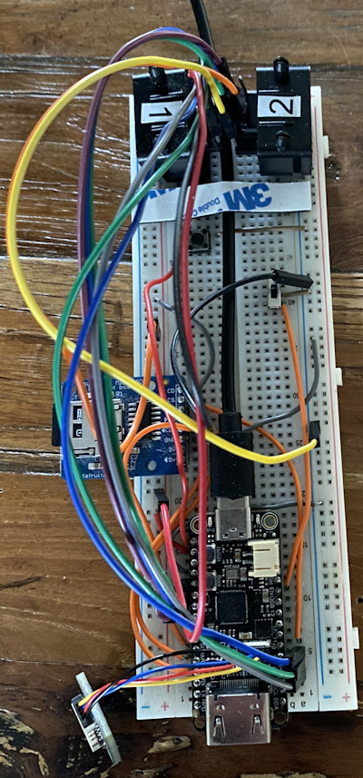

***

## Adafruit Metro RP2350


This configuration supports USB controllers and legacy controllers. (NES / SNES / Wii Classic). 

### Materials needed

- [Adafruit Metro RP2350](https://www.adafruit.com/product/6003) or [Adafruit Metro RP2350 with PSRAM](https://www.adafruit.com/product/6267)
- [22-pin 0.5mm pitch FPC flex cable for DSI CSI or HSTX.](https://www.adafruit.com/product/6036)
- [Adafruit RP2350 22-pin FPC HSTX to DVI Adapter for HDMI Displays.](https://www.adafruit.com/product/6055) 
- USB-C power supply. 
- [USB-C to USB-C - USB-A Y cable.](https://a.co/d/9vCzu0h) when using a USB game controller. The Y-cable is needed to connect the game controller and power the board at the same time.
- [USB-C to USB-A cable](https://a.co/d/2i7rJid) for flashing the uf2 onto the board 
- FAT32 or exFAT formatted Micro SD card with ROMs you legally own. ROMs must have the .nes extension. You can organise your ROMs into different folders.

> [!NOTE]
> Use a USB-C power supply to power the board instead of the barrel jack. Powering the board using the barrel jack can cause USB game controllers to not work properly.

> [!NOTE]
> You can use the [USB host pins](https://learn.adafruit.com/adafruit-metro-rp2350/pinouts#usb-host-pins-3193156) on the board to connect a USB game controller instead. Soldering is required for this. You also need to build the binary from source, since it is currently not included in the latest release. For more info see [pio_usb.md](pio_usb.md)


#### Legacy Controllers

 * Depending on what you have:
    * one or two NES controllers.
      * [NES controller port](https://www.zedlabz.com/products/controller-connector-port-for-nintendo-nes-console-7-pin-90-degree-replacement-2-pack-black-zedlabz)
      * [An original NES controller](https://www.amazon.com/s?k=NES+controller&crid=1CX7W9NQQDF8H&sprefix=nes+controller%2Caps%2C174&ref=nb_sb_noss_1)
      * [Dupont male to female wires](https://a.co/d/cJVmnQO)
    * Wii Classic controller
      *  [Adafruit Wii Nunchuck Breakout Adapter - Qwiic / STEMMA QT](https://www.adafruit.com/product/4836)
      *  [Adafruit STEMMA QT / Qwiic JST SH 4-pin Cable](https://www.adafruit.com/product/4210)
      *  [Wii Classic wired controller](https://www.amazon.com/Classic-Controller-Nintendo-Wii-Remote-Console/dp/B0BYNHWS1V/ref=sr_1_1_sspa?crid=1I66OX5L05507&keywords=Wired+WII+Classic+controller&qid=1688119981&sprefix=wired+wii+classic+controller%2Caps%2C150&sr=8-1-spons&sp_csd=d2lkZ2V0TmFtZT1zcF9hdGY&psc=1)

#### Wii nunchuck breakout adapter.

Connect the nunchuck breakout adapter to the Metro using the STEMMA QT cable.

#### NES controller port(s). (if you want to use legacy NES controllers).

|               | Port 1 | Port 2 (optional) | Note |
| ------------- | ---- | ------ | ---------- |
| GND           |      | | Any GND pin |
| VCC (Power)   |      | | Any 3V3 pin        |
| NES Clock     | GPIO2 | GPIO5 |          |
| NES LATCH     | GPIO4 | GPIO7 |        |
| NES Data      | GPIO3 | GPIO6 |        |


> [!NOTE]
> An original SNES controller can be wired to the same pins. The emulator detects automatically whether an NES or a SNES controller is attached.

### flashing the Adafruit Metro RP2350

- Download **[piconesPlus_AdafruitMetroRP2350_arm.uf2](https://github.com/fhoedemakers/pico-infonesPlus/releases/latest/download/piconesPlus_AdafruitMetroRP2350_arm.uf2)** from the [releases page](https://github.com/fhoedemakers/pico-infonesPlus/releases/latest).
- Connect the USB-C port to a USB port on your computer using the USB-C to USB-A data cable.
- On the board, push and hold the BOOT button, then press RESET. Release the buttons, the drive RPI-RP2 should appear on your computer.
- Drag and drop the UF2 file on to the RPI-RP2 drive. The board will reboot and will now run the emulator.
  
***

## Adafruit Fruit Jam

> [!NOTE]
> The latest HSTX video driver update adds support for HDMI audio output. Make sure **External Audio** is disabled in the options menu.

The new [Adafruit Fruit Jam](https://www.adafruit.com/product/6200) is supported as well.

### materials needed

- [Adafruit Fruit Jam](https://www.adafruit.com/product/6200) 
- USB gamepad
- Power to USB-C
- Optional
  * If you want to use a Wii Classic controller:
    * [Adafruit Wii Nunchuck Breakout Adapter - Qwiic / STEMMA QT](https://www.adafruit.com/product/4836)
    * [Wii Classic controller](https://www.amazon.com/s?k=Wii+Classic+controller&crid=1I66OX5L05507&sprefix=wii+classic+controller%2Caps%2C150&ref=nb_sb_noss_1)
  * External speakers


### Setup

- Connect your USB gamepad to the USB 1 port of the Fruit Jam.
- If you want to use a Wii Classic controller, connect the nunchuck breakout adapter to the Fruit Jam using the STEMMA QT cable and the Wii Classic controller to the breakout adapter.
- Connect external speakers to the audio output of the Fruit Jam.

To enable audio over HDMI make sure the setting **External audio** is disabled in the options menu.

When **External audio** is enabled, audio will be played through the external speakers and mini speaker simultaneously. Press Button 1 on the Fruit Jam to mute the mini speaker

Flash the firmware onto the Fruit Jam. (Connect the Fruit Jam to your computer via its USB-C connector, then hold Reset and Button 1). Copy [piconesPlus_AdafruitFruitJam_arm_piousb.uf2](https://github.com/fhoedemakers/pico-infonesPlus/releases/latest/download/piconesPlus_AdafruitFruitJam_arm_piousb.uf2) to the RPI-RP2 drive.

Please keep the following in mind:

- Not all USB controllers from the [supported controllers](#usb--game-controllers) list are guaranteed to work.
- Two player mode is only possible with one USB gamepad on USB1 and one Wii Classic controller. USB2 is not supported for two player mode yet, will be looking into it. 
- When a USB controller is connected, the Wii Classic controller is player 2. To use the Wii Classic controller as player 1, unplug the USB controller.


***

## Waveshare RP2040/RP2350-PiZero Development Board

### materials needed

- One of these Waveshare boards:
  - [Waveshare RP2040-PiZero Development Board](https://www.waveshare.com/rp2040-pizero.htm).
  - [Waveshare RP2350-PiZero Development Board](https://www.waveshare.com/rp2350-pizero.htm).
    - Optional: [PSRAM chip](https://www.adafruit.com/product/4677) When installed, the emulator loads ROMs from PSRAM instead of flash memory for significantly faster performance. Fully functional even without PSRAM. Boards using a flash chip from a brand other than Winbond need a one-time fix before PSRAM works, see [PSRAM with a non-Winbond flash chip](#psram-with-a-non-winbond-flash-chip).
- [USB-C to USB-A cable](https://a.co/d/2i7rJid) for flashing the uf2 onto the board.
- USB-C Power supply. Connect to the port labelled USB, not PIO-USB. See note below.
- [Mini HDMI to HDMI Cable](https://a.co/d/5BZg3Z6).
- FAT32 or exFAT formatted Micro SD card with ROMs you legally own. ROMs must have the .nes extension. You can organise your ROMs into different folders.

Additional for the RP2040-Pizero only:

- [USB-C to USB-C - USB-A Y cable](https://a.co/d/eteMZLt), when using a USB controller. Not needed for the Waveshare RP2350-PiZero where the controller **must** be connected to the PIO-USB port.

> [!NOTE]
> Unlike the WaveShare RP2350-PiZero, where the controller must be connected to the PIO-USB port, the WaveShare RP2040-PiZero Development Board cannot use the PIO-USB port for the controller due to memory limitations.  Instead, connect both the controller and the power adapter to the Y-cable, and then plug the Y-cable into the board’s port labeled “USB.” While the PIO-USB port can still be used to power the RP2040 board, I do not recommend this, as it has occasionally caused unstable behavior.

#### NES controller port.

When using an original NES controller you need:

- [NES controller port](https://www.zedlabz.com/products/controller-connector-port-for-nintendo-nes-console-7-pin-90-degree-replacement-2-pack-black-zedlabz)
- [An original NES controller](https://www.amazon.com/s?k=NES+controller&crid=1CX7W9NQQDF8H&sprefix=nes+controller%2Caps%2C174&ref=nb_sb_noss_1)
- [Dupont female to female wires](https://a.co/d/cJVmnQO)

For two player games with two NES controllers you need an extra NES controller port, controller and wire


|           | Port 1 | Port 2 (Optional) | Note |
| ------------- | ---- | ----- | ---------- |
| GND           |      | | Any ground pin |
| VCC (Power)   |      | | 5Volt pin         |
| NES Clock     | GPIO5 | GPIO10 |          |
| NES LATCH     | GPIO9 | GPIO11|        |
| NES Data      | GPIO6 | GPIO12|        |


> [!NOTE]
> An original SNES controller can be wired to the same pins. The emulator detects automatically whether an NES or a SNES controller is attached.

> [!NOTE]
> Contrary to other configurations where VCC is connected to 3 volt, VCC should be connected to a 5 volt pin. Otherwise the NES controller may not work.

#### Wii Classic controller.

When using a Wii Classic controller you need:

-  [Adafruit Wii Nunchuck Breakout Adapter - Qwiic / STEMMA QT](https://www.adafruit.com/product/4836)
-  [STEMMA QT / Qwiic JST SH 4-pin Cable with Premium Female Sockets](https://www.adafruit.com/product/4397) 
-  [Wii Classic wired controller](https://www.amazon.com/s?k=wii-classic+controller)

Connections are as follows:

| Nunchuck Breakout Adapter | RP2040-PiZero |
| ---------------------- | ------------ |
| 3.3V                   | 3V3          |
| GND                    | GND          |
| SDA                    | GPIO2        |
| SCL                    | GPIO3        |

### flashing the Waveshare RP2040-PiZero Development Board
- Download **[piconesPlus_WaveShareRP2040PiZero_arm.uf2](https://github.com/fhoedemakers/pico-infonesPlus/releases/latest/download/piconesPlus_WaveShareRP2040PiZero_arm.uf2)** from the [releases page](https://github.com/fhoedemakers/pico-infonesPlus/releases/latest).
- Connect the USB-C port marked USB (not PIO-USB) to a USB port on your computer using the USB-C to USB-A data cable.
- On the board, push and hold the BOOT button, then press RUN. Release the buttons, the drive RPI-RP2 should appear on your computer.
- Drag and drop the UF2 file on to the RPI-RP2 drive. The board will reboot and will now run the emulator.


### flashing the Waveshare RP2350-PiZero Development Board
- Download **[piconesPlus_WaveShareRP2350PiZero_arm_piousb.uf2](https://github.com/fhoedemakers/pico-infonesPlus/releases/latest/download/piconesPlus_WaveShareRP2350PiZero_arm_piousb.uf2)** from the [releases page](https://github.com/fhoedemakers/pico-infonesPlus/releases/latest).
- Connect the USB-C port marked USB (not PIO-USB) to a USB port on your computer using the USB-C to USB-A data cable.
- On the board, push and hold the BOOT button, then press RUN. Release the buttons, the drive RPI-RP2 should appear on your computer.
- Drag and drop the UF2 file on to the RPI-RP2 drive. The board will reboot and will now run the emulator.

> [!NOTE]
>  When the emulator won't start after flashing or powering on, and the screen shows 'No signal,' press the run button once again. The emulator should now boot.

### Image: one or two player setup with USB controller and NES controller port

In this image the NES controller port is wired to port 1.

For single player games, connect either a USB controller **or** a NES controller. Not both!

For two player games: Connect a USB controller for player 1 and a NES controller for player 2.

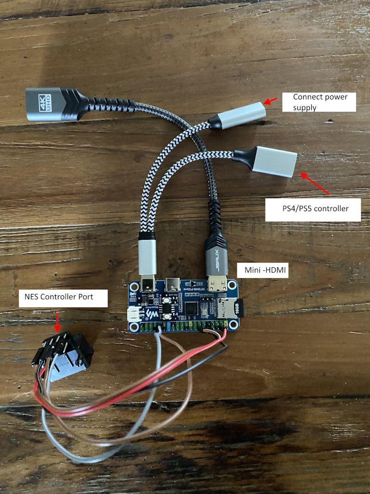

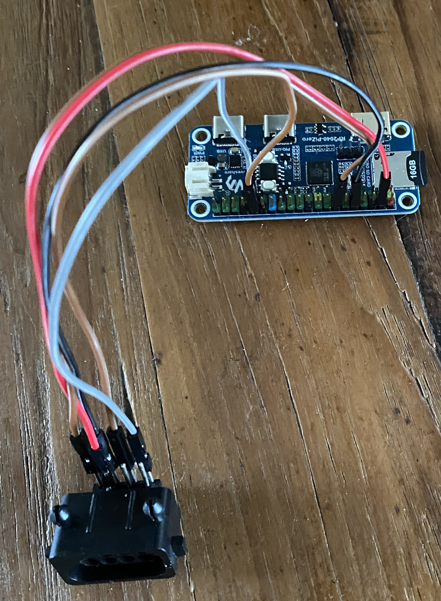

### Image: Two player setup using two NES controllers or a USB controller and a NES controller

Choose either of the following:

- Connect two NES controllers 
- Connect a USB controller for player 1 and a NES controller for player 2. You can use either NES controller ports.

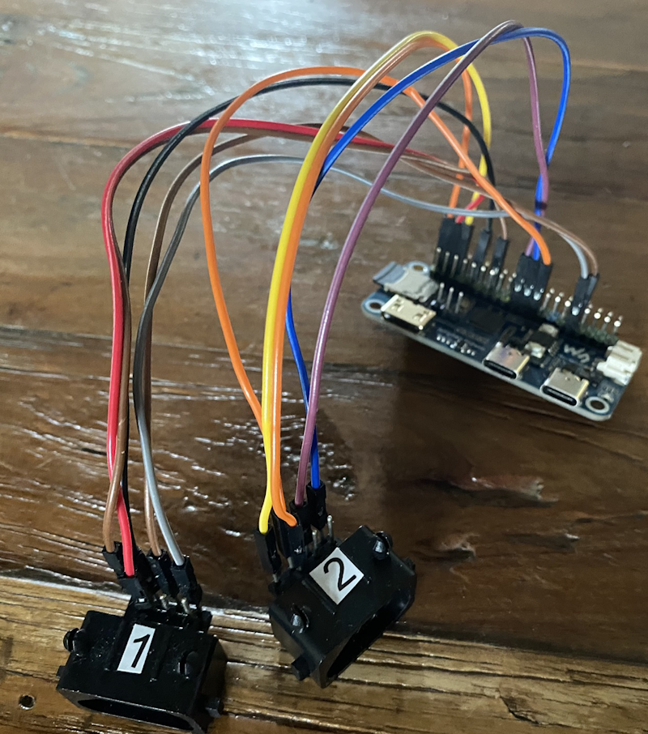

### Image: Using a Wii Classic controller


### 3D printed case for RP2040/RP2350-PiZero

Gavin Knight ([DynaMight1124](https://github.com/DynaMight1124)) designed a NES-like case you can 3D print as an enclosure for this board.  This enclosure is designed for 2 NES controller ports so you can play 1 or 2-player games. [Click here for the design](https://www.thingiverse.com/thing:6758682). Please contact the creator on their Thingiverse page if you have any questions about this case.


***

## PCB with Raspberry Pi Pico or Pico 2 and Pimoroni Pico Plus 2

Create your own Pico-based NES console. It features two NES controller ports for 1 or 2-player games.

Designed by [@johnedgarpark](https://twitter.com/johnedgarpark)


Several companies can make these PCBs for you. 

I personally recommend [PCBWay](https://www.pcbway.com/). The boards I ordered from them are of excellent quality. They also have a very short lead time. Boards I ordered on Monday arrived from China to my home in the Netherlands on Friday of the same week.

[](https://www.pcbway.com/)

When ordering, simply upload the zip file containing the gerber design.  This file (pico_nesPCB_v2.6.zip) is available on the [releases page](https://github.com/fhoedemakers/pico-infonesPlus/releases/latest) and can also be found in the [PCB folder of the pico_shared repository](https://github.com/fhoedemakers/pico_shared/tree/main/PCB). 

> [!NOTE]
> Design v2.6 adds through-holes for the Pico. You can either solder the board flat onto the PCB as before, or plug in a Raspberry Pi Pico, Pico 2 or [Pimoroni Pico Plus 2](https://shop.pimoroni.com/products/pimoroni-pico-plus-2?variant=42092668289107) fitted with male headers. Designs up to and including v2.1 have no through-holes and require the board to be soldered flat.
> When you mount the Pico with headers, make sure to print the latest top cover from Thingiverse, see [3D printed case for PCB](#3d-printed-case-for-pcb).

> [!NOTE]
>  Soldering skills are required. Make sure you solder all the connections from the Pico onto the PCB. Also the connections on the short right-side of the Pico. (For ground)

> [!NOTE]
> If you are looking for the previous design (v0.2). You can find it [here](PCB/v0.2)

> [!NOTE]
> Sellers on AliExpress have copied the PCB design and are selling pre-populated PCBs. For questions about those boards, please contact the seller on AliExpress.

Other materials needed:

- One of the following, depending on how you want to mount it onto the PCB:
  * Raspberry Pi Pico or Pico 2 **with no headers**, soldered flat onto the PCB. Works with every design version.
  * Raspberry Pi Pico, Pico 2 or [Pimoroni Pico Plus 2](https://shop.pimoroni.com/products/pimoroni-pico-plus-2?variant=42092668289107) **with soldered male headers**, plugged into the through-holes. Requires design v2.6 or later, see the note above. You can use [these headers](https://a.co/d/dSNPuyo).
- [Adafruit DVI Breakout Board - For HDMI Source Devices](https://www.adafruit.com/product/4984)
- [Adafruit Micro SD SPI or SDIO Card Breakout Board - 3V ONLY!](https://www.adafruit.com/product/4682)
- For the NES controllers:
  * [1 or 2 NES controller port(s)](https://www.zedlabz.com/products/controller-connector-port-for-nintendo-nes-console-7-pin-90-degree-replacement-2-pack-black-zedlabz)
  * [1 or 2 NES controller(s)](https://www.amazon.com/s?k=NES+controller&crid=1CX7W9NQQDF8H&sprefix=nes+controller%2Caps%2C174&ref=nb_sb_noss_1)
- [Micro USB to OTG Y-Cable](https://a.co/d/b9t11rl) if you want to use a DualShock/DualSense controller.
- Micro USB power supply.
- Optional: on/off switch, like [this](https://www.kiwi-electronics.com/en/spdt-slide-switch-410?search=KW-2467) 

When using a Pico / Pico W, Flash **[piconesPlus_AdafruitDVISD_pico_arm.uf2](https://github.com/fhoedemakers/pico-infonesPlus/releases/latest/download/piconesPlus_AdafruitDVISD_pico_arm.uf2)** / **[piconesPlus_AdafruitDVISD_pico_w_arm.uf2](https://github.com/fhoedemakers/pico-infonesPlus/releases/latest/download/piconesPlus_AdafruitDVISD_pico_w_arm.uf2)** from the [releases page](https://github.com/fhoedemakers/pico-infonesPlus/releases/latest). 
When using a Pico 2 or Pico 2 W, flash **[piconesPlus_AdafruitDVISD_pico2_arm.uf2](https://github.com/fhoedemakers/pico-infonesPlus/releases/latest/download/piconesPlus_AdafruitDVISD_pico2_arm.uf2)** / **[piconesPlus_AdafruitDVISD_pico2_w_arm.uf2](https://github.com/fhoedemakers/pico-infonesPlus/releases/latest/download/piconesPlus_AdafruitDVISD_pico2_w_arm.uf2)** instead.
When using a Pimoroni Pico Plus 2, flash **[piconesPlus_AdafruitDVISD_pico2_arm.uf2](https://github.com/fhoedemakers/pico-infonesPlus/releases/latest/download/piconesPlus_AdafruitDVISD_pico2_arm.uf2)** as well. The PSRAM on the board is used instead of flash to load the ROMs from SD.

> [!IMPORTANT]
> A [Pimoroni Pico Plus 2](https://shop.pimoroni.com/products/pimoroni-pico-plus-2?variant=42092668289107) can only be used with design v2.6 or later, and only when male headers are soldered onto it. On v2.1 and older designs the board has to lie flat on the PCB, which the SP/CE connector on the back of the Pico Plus 2 prevents.

### Image: Two player setup using two NES controllers or a USB controller and a NES controller

Choose either of the following:

- Connect two NES controllers 
- Connect a USB controller for player 1 and a NES controller for player 2. You can use either NES controller ports. Use the OTG Y-Cable to connect a USB power supply and the USB controller.


### NES Zapper (light gun)

> [!NOTE]
> Beta. Works on the **PCB only**, in **controller port 2**, and needs a **third-party light gun** such as the Tomee Zapp Gun - an original Nintendo Zapper will not work on a flat panel unmodified. See [Which gun you need](#which-gun-you-need) below.

PCB design **v2.1 and later** (so also the current v2.6) route the two extra data lines of NES controller port 2 to the Pico: **D3 → GPIO27** (light sensor) and **D4 → GPIO28** (trigger). The emulator reads those two lines directly into bits 3 and 4 of `$4017`, exactly as a real NES does. Flash one of the **piconesPlus_AdafruitDVISD_*** binaries (the PCB firmware); on all other boards GPIO27 and GPIO28 are already in use for something else, so Zapper support is not compiled in there.

No setting has to be enabled. The gun is detected automatically the moment it is plugged in, because a Zapper actively drives its trigger line low while the trigger is released. A regular NES or SNES controller can stay in port 2 alongside the gun and keeps working - only bits 3 and 4 of `$4017` come from the Zapper, the pad's own data line is untouched.

> [!NOTE]
> The Zapper **cannot be used on the Murmulator M1 and M2 boards**. Those PCBs leave D3 and D4 of the controller ports unconnected, so the gun's light and trigger lines never reach the board at all. This cannot be fixed in firmware.

#### Which gun you need

> [!IMPORTANT]
> An **original Nintendo Zapper does not work on a flat panel without a hardware modification**.
>
> Use a third-party light gun made for modern displays. The **Tomee Zapp Gun for NES** is confirmed working and is what this support was developed and tested with. [neslcdmod.com](https://neslcdmod.com/) lists it among the guns known to work.

#### Unmodified games will not work

The original light gun games time their light detection against a CRT, which puts a pixel on screen the instant it is scanned out. An LCD/LED TV adds milliseconds of lag, so an unmodified *Duck Hunt* scores every shot as a miss. This is a property of flat panels, not of the emulator - the same games fail the same way on real NES hardware connected to a modern TV.

[neslcdmod.com](https://neslcdmod.com/) provides IPS patches that add a calibration routine to compensate for that lag. Patches exist for **Duck Hunt**, **Wild Gunman**, **Hogan's Alley**, **Duck Hunt VS** and **Barker Bill's Trick Shooting**.

- Download the patch for the game you want from [neslcdmod.com/roms](https://neslcdmod.com/roms/).
- Apply it to the ROM revision the patch was made for, using a tool such as Lunar IPS or Flips. Check the ROM's CRC32 first - patching the wrong revision produces a broken ROM.
- Copy the patched `.nes` file to the SD card like any other ROM.

#### Calibrating

Put the TV in **game mode** first (it is the single biggest reduction in display lag), then boot the patched ROM and follow its on-screen calibration: aim at the target it shows (`SHOOT HERE` / `FIRE ME`) and fire straight into it. The delay can also be adjusted by hand - the arrows change it in the main menu, and pressing `Start` during play shows the current value so it can be nudged. Recalibrate after changing TV, screen mode, or the **Overclock** setting.

> [!TIP]
> If the gun does not respond, or shots always hit or always miss, see
> [zapper_troubleshooting.md](zapper_troubleshooting.md).

### 3D printed case for PCB

Gavin Knight ([DynaMight1124](https://github.com/DynaMight1124)) designed a NES-like case you can 3D print as an enclosure for this PCB.  You can find it here: [https://www.thingiverse.com/thing:6689537](https://www.thingiverse.com/thing:6689537). Here you can find two designs: the latest design for PCB v2.0  and the previous design for [PCB v0.2](PCB/v0.2). In the latest v2.0 design, you can choose between two top covers, one with a button connecting to the bootsel button for easy firmware upgrades, the other without the button. In this case you have to remove the top cover to access the bootsel button. See images below. Make sure to print the correct files for the PCB version you own. You can find more information on Gavin's Thingiverse page.

> [!IMPORTANT]
> When the Pico is plugged into the through-holes of PCB v2.6 with male headers, always download the **latest** top case design from Thingiverse. Because the Pico sits higher on the board when headers are used, only the newest top cover leaves enough room for the USB cable to fit. The older covers were designed for a Pico soldered flat onto the PCB.

#### Top Cover v2.0 without button (Top_v2.0.stl)


#### Top Cover v2.0 with bootsel button (Top_v2.0_with_Bootsel_Button.stl)


#### Base v2.0 (Base_v2.0.stl) 


#### on/off button (Power_Switch.stl)


***

## PCB with WaveShare RP2040/RP2350 Zero

Create your own Pico-based NES console. It features two NES controller ports for 1 or 2-player games. This version is smaller than the above and uses cheaper, but ultimately harder to solder components. This is a more advanced project than the above PCB design; if you are unsure of your soldering capabilities I wouldn't recommend this PCB.

Several companies can make these PCBs for you. PCBWay or JLCPCB are two good options.

I personally recommend [PCBWay](https://www.pcbway.com/). The boards I ordered from them are of excellent quality. They also have a very short lead time. Boards I ordered on Monday arrived from China to my home in the Netherlands on Friday of the same week.

[](https://www.pcbway.com/)

When ordering, simply upload the zip file containing the gerber design.  This file (Gerber_PicoNES_Mini_PCB_v2.0.zip) is available on the [releases page](https://github.com/fhoedemakers/pico-infonesPlus/releases/latest) and can also be found in the [PCB folder of the pico_shared repository](https://github.com/fhoedemakers/pico_shared/tree/main/PCB). 

> [!NOTE]
>  Soldering skills are required. Make sure you solder all the connections from the Pico onto the PCB. This version requires good soldering skills especially for the HDMI portion, a good amount of flux and a fine tip will be required, additional solder can be wicked away with solder wick. I recommend starting with the resistor arrays first, then the HDMI port, after that either Pico or MicroSD adaptor, lastly the NES Ports, which can be hard to push into the PCB.

Please see the Instructables link for the guide and components needed: https://www.instructables.com/PicoNES-RaspberryPi-Pico-Based-NES-Emulator/


When using a RP2040 Zero, flash **[piconesPlus_WaveShareRP2040ZeroWithPCB_arm.uf2](https://github.com/fhoedemakers/pico-infonesPlus/releases/latest/download/piconesPlus_WaveShareRP2040ZeroWithPCB_arm.uf2)** from the [releases page](https://github.com/fhoedemakers/pico-infonesPlus/releases/latest). 
When using a RP2350 Zero, flash **[piconesPlus_WaveShareRP2350ZeroWithPCB_arm.uf2](https://github.com/fhoedemakers/pico-infonesPlus/releases/latest/download/piconesPlus_WaveShareRP2350ZeroWithPCB_arm.uf2)** instead.


### 3D printed case for PCB

Gavin Knight ([DynaMight1124](https://github.com/DynaMight1124)) designed a NES-like case you can 3D print as an enclosure for this PCB.  You can find it here: https://www.thingiverse.com/thing:7041536. If you don't own a 3D printer, you can either find a local company that offers 3D printing services or use professional services such as PCBWay or JLCPCB; the professional services can offer extremely high quality finishes.

#### 3D printed case


#### 3D printed case from professional services (JLCPCB in this example)


#### Soldered PCB


> [!NOTE]
>  The PCB has been updated to v2.0, with improvements to the SD slot and easier to solder components around the HDMI port, however you can still find v1.0 design files, gerber and BOM here: https://www.thingiverse.com/thing:7041536

***

## PCB with WaveShare RP2350 USB A

Based around the WaveShare RP2350 USB A board along with a PCB, which creates a micro PicoNES with 1 player controls via USB. There's a full guide here: https://www.instructables.com/PicoNES-RaspberryPi-Pico-Based-NES-Emulator/

Several companies can make these PCBs for you. PCBWay or JLCPCB are two good options.

I personally recommend [PCBWay](https://www.pcbway.com/). The boards I ordered from them are of excellent quality. They also have a very short lead time. Boards I ordered on Monday arrived from China to my home in the Netherlands on Friday of the same week.

[](https://www.pcbway.com/)

When ordering, simply upload the zip file containing the gerber design. This file (Gerber_PicoNES_Micro_v1.2.zip) is available on the [releases page](https://github.com/fhoedemakers/pico-infonesPlus/releases/latest) and can also be found in the [PCB folder of the pico_shared repository](https://github.com/fhoedemakers/pico_shared/tree/main/PCB).

Flash **[piconesPlus_WaveShare2350USBA_arm_piousb.uf2](https://github.com/fhoedemakers/pico-infonesPlus/releases/latest/download/piconesPlus_WaveShare2350USBA_arm_piousb.uf2)** from the [releases page](https://github.com/fhoedemakers/pico-infonesPlus/releases/latest). The game controller connects to the USB A port; the USB-C port is used for power and for flashing the firmware.

#### PicoNES Micro populated PCB - NES controller shown for scale


#### 3D Printed Case


#### Build Guide
https://www.instructables.com/PicoNES-RaspberryPi-Pico-Based-NES-Emulator/

> [!NOTE]
>  Due to the small size, micro soldering skills are required. It uses 0603 sized SMD components. Please see the Instructables link for information.


***

# Using metadata.

Download the metadata pack from the [releases page](https://github.com/fhoedemakers/pico-infonesPlus/releases/latest/download/PicoNesMetadata.zip) and extract its contents to the root of the SD card. It contains box art and game info for many games. The metadata is used in the menu to show box art and game info when a rom is selected. Press START to view the information. When the screensaver is started, random box art is shown.


***

# Gamepad and keyboard usage

|     | (S)NES | Genesis | XInput | DualShock/DualSense | Wii Classic |
| --- | ------ | ------- | ------ | ---------------- | ----------- |
| Button1 | B  |    A    |   A    |    X             |   B         |
| Button2 | A  |    B    |   B    |   Circle         |   A         |
| Button3 | X (SNES only) | C | Y | Triangle    |   X         |
| Select  | select | Mode or C | Select | Select     |   Select    |

> [!NOTE]
> An original NES controller has no Button3. Everything reachable with it can also be reached from the settings menu.

## Menu 
Gamepad buttons:
- UP/DOWN: Next/previous item in the menu.
- LEFT/RIGHT: next/previous page.
- Button2: Open folder/flash and start game.
- Button1: Back to parent folder.
- Button3: Open the [recently played list](#recently-played-games).
- START: Show [metadata](#using-metadata) and box art (when available)
- SELECT: Opens the settings menu. Here you can change settings like screen mode, scanline type, framerate display, menu colours and other board specific settings. The settings menu can also be opened in-game. See [Settings menu](#settings-menu) below for the full list.
- SELECT + Button2: Force DVI mode (HSTX only). Useful if a DVI monitor shows no picture. This will restore the image.

When using a USB keyboard:
- Cursor keys: Up, Down, left, right
- Z: Back to parent folder
- X: Open Folder/flash and start a game
- C: Open the [recently played list](#recently-played-games).
- S: Show [metadata](#using-metadata) and box art (when available).
- A: acts as the select button.

## Recently played games

The menu keeps a list of the **last 20 games you started**, most recent first. Open it with **Button3** in the menu, or with the **Recently played** entry at the top of the [settings menu](#settings-menu). That entry is only there when the settings menu is opened from the menu - a game cannot be started from inside a running game.

> [!NOTE]
> On an original 3-button Genesis Mini controller, C acts as SELECT and opens the settings menu instead. Take the **Recently played** entry there.

In the list:

| Button | Action |
| ------ | ------ |
| UP/DOWN | Select a game. |
| Button2 | Start the highlighted game. |
| Button1 | Close the list and return to the menu. |
| SELECT | Remove the highlighted game from the list. Asks for confirmation first. This only removes the entry, the ROM on the SD card is left alone. |
| START | Show [metadata](#using-metadata) and box art (when available). |

Games are added to the list automatically when you start them, so nothing has to be enabled. Starting a game that is already in the list moves it back to the top. The list closes by itself after a minute without input.

The list is kept in **`/recent_NES.txt`** in the root of the SD card, as plain text with one game per line. It survives a reboot and can be read, edited or deleted on a PC. Deleting the file simply empties the list, and a damaged file is treated as an empty list - unlike the settings file, nothing else is reset. Each emulator running under [pico-bootLoader](#running-under-pico-bootloader) keeps its own list.

If a game was moved, renamed or deleted on the SD card in the meantime, the list says so instead of starting it. Use SELECT to remove such an entry.

On boards **without** PSRAM, one entry can be tagged **[READY]**. That is the game whose ROM is currently written to flash, which is the one that starts without waiting for the flashing step. See [PSRAM](#psram).

## Settings menu

The settings menu is opened with SELECT from the main menu, or with SELECT + START while a game is
running. Not every entry is available on every board or in every situation.

| Setting | Description |
| ------- | ----------- |
| Select disk | Change the FDS disk side. Only for FDS games, and always the first entry. |
| Quit game / Back to main menu | Leave the game and return to the SD card menu. Battery-backed save RAM is written to the SD card here. In-game only. |
| Reset game | Reset the running game. In-game only. |
| Save/Load State | Manage save states. In-game only. |
| Recently played | Open the list of the [last 20 games you started](#recently-played-games) and restart one of them. Menu only, not available in-game. |
| Screen Mode | Cycle the screen modes, including the 8:7 pixel aspect ratio modes. |
| Scanline Type | Simple or LCD style scanlines. HSTX boards only. |
| Framerate Overlay | Show the frames per second on screen. |
| Display Mode | HDMI or DVI output. HSTX boards only. |
| External Audio | Route audio to the I2S/line-out output instead of HDMI. Selecting DVI as Display Mode enables this automatically, because DVI carries no audio. |
| Menu Font Color / Menu Font Back Color | Menu colours (0-63). |
| Fruit Jam VU Meter / Fruit Jam Volume Control | Fruit Jam only. |
| Rapid Fire on A / Rapid Fire on B | Enable rapid fire per button. |
| FDS Auto Swap Disk side | Swap the disk side automatically when the game asks for it. Off by default. FDS games only. |
| FDS Auto Insert Disk 1 On Start | Insert disk 1 automatically at start. On by default. FDS games only. |
| Overclock | Raise the CPU clock from 252 MHz to 378 MHz. Only on HSTX boards with PSRAM, and currently only needed for *Lagrange Point (JP)*. Menu only, not available in-game. |
| Controller Test | Show a gamepad graphic that follows the controller you last pressed a button on, plus a list of connected input sources. Useful for checking wiring and button mappings. Hold SELECT + START for 2 seconds to exit. |
| Enter BOOTSEL Mode | Reboot into BOOTSEL so you can flash new firmware. |
| USB Drive Mode | Show the SD card on a computer as a USB drive, so games can be added or removed without taking the card out. See [USB drive mode](#usb-drive-mode). Menu only, not available in-game. |
| Return to emulator selection | Go back to the emulator picker. Only present in [pico-bootLoader](#running-under-pico-bootloader) builds. |

> [!NOTE]
> Changes are only applied when you select **SAVE**. **CANCEL** discards them, **DEFAULT** restores the default values.

## Emulator (in game)
Gamepad buttons:
- SELECT + START, Xbox button: opens the settings menu. From there, you can:
  - Quit the game and return to the SD card menu
  - Reset the game
  - Manage save states. Load or save your game state to one of 5 slots plus a quick save slot. Enable auto save/load state on exit/start.
  - Adjust settings and resume your game.
- SELECT + UP/SELECT + DOWN: switches screen modes, including the 8:7 pixel aspect ratio modes.
- START + Button2: Toggle framerate display
- START + DOWN : (quick) Save state. (Quick Save slot)
- START + UP : (quick) Load state. (Quick Save slot)
- SELECT + START + UP + Button2 (all held together): Reboot into BOOTSEL mode for flashing new firmware.
- **Pimoroni Pico DV Demo Base and Murmulator only**: SELECT + LEFT: Switch audio output to the connected speakers on the line-out jack. The speaker setting will be remembered when the emulator is restarted. Not available on boards that output audio over HDMI.
- **Fruit Jam Only** 
  - pushbutton 2 (on board) or SELECT + RIGHT: Toggles the VU meter on or off. (NeoPixel LEDs light up in sync with the music rhythm)
  - START + LEFT/RIGHT: Adjust volume of built-in speaker and external audio jack.
- **RP2350 with PSRAM only**: Record about 30 seconds of audio by pressing START to pause the game and then START + Button1. Audio is recorded to **/soundrecorder.wav** on the SD card.
- **Genesis Mini Controller**: When using a Genesis Mini controller with 3 buttons, press C for SELECT. On 8-button Genesis controllers, press MODE for SELECT.
- **USB keyboard**: When using a USB keyboard
  - Cursor keys: up, down, left, right
  - A: SELECT
  - S: START
  - Z: Button1
  - X: Button2

> [!NOTE]
> Rapid fire is not a button combination. Enable it per button with the **Rapid Fire on A** / **Rapid Fire on B** entries in the settings menu.

Save States should work for  mapper 0,1,2,3 and 4. Other mappers may or may not work. Below the games that use these mappers.

  - https://nesdir.github.io/mapper1.html
  - https://nesdir.github.io/mapper2.html
  - https://nesdir.github.io/mapper3.html
  - https://nesdir.github.io/mapper4.html

  The mapper number is also shown in the Save State screen.

***

# Famicom Disk System (FDS) Games

FDS games are supported with the following requirements:

- A BIOS file is required. Place it at `/bios/fds-bios.rom` on the SD card. The file must be exactly 8 KB.
- An RP2350 board. RP2040 does not meet the memory requirements.
- You need ROMs with the `.fds` extension.

FDS games have these features:

- For games that can write save data back to disk, you must go back to the menu to save the game. Saves are written to `/SAVES/<gamename>_fds.SAV`. For single-side disk images the file is `/SAVES/<gamename>_fds_s<N>.SAV`, one per side. Save states are not supported for FDS games.
  
### Swapping Disks

When prompted to swap disks, use the in-game settings menu:

1. Press **SELECT + START** to open the settings menu.
2. Select the first option (**Select disk**) to change the disk.
3. Press **LEFT/RIGHT** to choose the disk side.
4. Press **Button2** to confirm and return.

### Auto Swapping disks

In the settings menu, there is an option **FDS Auto Swap Disk side**. This is disabled by default. When enabled, the emulator will automatically swap the disk side when the game asks for it. Note that in some cases you still need to swap the disks manually.

There is a second FDS option, **FDS Auto Insert Disk 1 On Start**, which inserts disk 1 automatically when the game starts. This one is enabled by default.

***

# Playing NSF audio files

The emulator can play Nintendo Sound Format files. These are ROMs with the `.nsf` extension. This works on both the RP2040 and RP2350 boards.

Each NSF file can have multiple tracks. Loading a `.nsf` ROM from the menu will automatically start the first track.  Each track is played for a maximum duration of 3 minutes, after which the next track is played. When there is silence for more than 3 seconds, the next track is played as well.

**Controls**

- Right/Left: Next/Previous track.
- Button1: Stop Playback
- Button2: Resume playback.
- Select + Start: Back to the menu.


***

# WAV Music Playback in menu (RP2350 Only)

The menu allows you to play music files. Files must meet the following requirements:

- **Format:** WAV  
- **Bit depth:** 16-bit or 24-bit  
- **Sample rate:** 44.1 kHz  
- **Channels:** Stereo  
- **File extension:** `.wav`  

> [!NOTE]
> The sample rate is not checked. There is no resampler, so a file recorded at a different sample rate will play back at the wrong speed.

## How to Play
1. Select a music file from the menu.
2. Press **Button2** or **START** to start playback.
3. Press **Button2** or **START** again to stop playback.

## Converting MP3 to WAV
You can easily convert MP3 files to WAV using [Audacity](https://www.audacityteam.org/):

1. Open the MP3 file in Audacity.
2. Go to **File → Export → Export Audio**.
3. Choose the following settings:
   - **Format:** WAV (Microsoft)
   - **Channels:** Stereo
   - **Sample rate:** 44,100 Hz
   - **Encoding:** Signed 16-bit PCM
4. Copy the exported WAV file to the SD card.

***

# Save games
For games which support it, battery-backed save RAM is stored in the `/SAVES` folder of the SD card, as `<gamename>.SAV`.

> [!CAUTION]
> The save RAM is only written back to the SD card when you quit the game properly: press **SELECT + START** to open the settings menu, then choose **Quit game**. Powering off or resetting the board while the game is running loses everything since the last save.

***

# USB drive mode

USB drive mode presents the SD card to a computer as a USB mass storage device, so games can be added or
removed without taking the card out of the console. Connect the console to the computer, open the
[settings menu](#settings-menu) with SELECT from the game list and choose **USB Drive Mode**. The card
appears on the computer as a removable drive.

The entry is only offered when the settings menu is opened from the game list. It is not available while
a game is running: the running game holds its save files open and its ROM is mapped out of flash, and
letting the computer rewrite the card underneath that would corrupt both.

When you are finished, eject the drive on the computer. The console notices this and leaves USB drive
mode by itself. Pressing B on the console leaves as well, for when no computer is attached. The game
list is re-read on the way out, so files added from the computer appear without having to restart.

> [!NOTE]
> Transfers are slow. The console is a USB full-speed device and reaches the card a sector at a time
> over SPI, so copying is far slower than reading the card in a card reader. USB drive mode is meant
> for adding or replacing a few games. For filling a card, or for copying a large amount of data, take
> the card out and use a card reader.

Behaviour depends on where controllers are connected on your board.

| Board | Behaviour |
| ----- | --------- |
| Controllers on a separate USB port (boards built with PIO USB, such as the Fruit Jam) | The console's own USB port is free, so controllers keep working and the screen stays on. The menu returns to the game list when you are done. |
| Controllers on the console's own USB port | That port is the one connected to the computer, so a USB controller cannot be used while the card is mounted. Press B on a controller in the NES port, or eject the drive on the computer. The console restarts afterwards. |
| RP2040 boards | As above, and the screen is switched off for as long as the card is mounted. These boards cannot drive the video output while the computer is reading the card. The menu explains this first and lets you go back without mounting anything. |
| SpotPear HDMI board | This board has no NES controller port, so with the USB port connected to the computer there is no button to press at all. Eject the drive on the computer to return. If no computer ever mounts the card, the console returns to the menu by itself after 20 seconds. |

> [!CAUTION]
> Eject the drive on the computer rather than pressing B. Ejecting makes the computer write out
> anything it still had cached, and the console leaves USB drive mode on its own once it has. Pressing
> B while the computer still has the drive open can leave files on the card incomplete.

***

# Raspberry Pico W and Pico2 W support
The emulator works with the Pico W (RP2040). Use the pico_w_ or pico2_w_ versions of the uf2 files in the latest release. The Pico W has a built-in wifi module. The wifi module is not used by the emulator. It is only used for enabling the LED to blink every 60 frames on the Pico W.  If you don't mind the LED blinking, you can use the pico_ versions of the uf2 files on the Pico W.

***

# USB game controller latency
Using a USB game controller introduces some latency. The legacy controllers ((S)NES, Wii Classic) have less latency.

***

# Troubleshooting USB controllers

## AliExpress Controllers (Mantapad)

When starting a game, and the controller is unresponsive, you have to unplug and replug the controller to get it working. Not all controllers behave this way. I have a SNES controller that has no problems. The NES controller however must always be replugged to make it work. It is kind of hit and miss.

> [!NOTE]
> When using a SNES style USB controller, press Y to set the controller up properly. Otherwise the B button will not work. You have to do this every time you start a game or boot into the menu.


## XInput style controllers.

Might not work with all controllers.

Tested devices:
- Xbox 360 : Works
- Xbox Series X controller : Works
- Xbox One controller : Works
- Xbox elite controller : Works
- 8bitdo SN30 Pro+ firmware V6.01: Works. With the controller switched off, hold X + Start to switch to XInput mode. (LED 1 and 2 will blink). Then connect to USB.
- 8bitdo Pro 2 firmware V3.04: Works. With the controller switched off, hold X + Start to switch to XInput mode. (LED 1 and 2 will blink). Then connect to USB.
- 8bitdo SN30 PRO Wired : Not working, recognized but no report
- 8bitdo SF30 PRO firmware v2.05 : Works. With the controller switched off, hold X + Start to switch to XInput mode. (LED 1 and 2 will blink). Then connect to USB.
- 8bitdo SN30 PRO firmware v2.05 : Not tested, should probably work

### Troubleshooting:

After flashing some bigger games, the controller might become unresponsive:
- Xbox Controller. Playing with batteries removed is recommended. When controller becomes unresponsive:
  - unplug and replug the controller.
  - If controller is still unresponsive, unplug the pico from power, wait a few seconds then plug it back in and press start to start the last flashed game.

- 8bitdo controllers, when controller becomes unresponsive:
  - Disconnect the controller.
  - Hold start to switch the controller off (if it has built-in battery).
  - reconnect the controller.

***

# Troubleshooting no image on TV or monitor

Some displays need 5V connected to the HDMI breakout in order to work:
- When using the breadboard with HDMI and SD breakout, make sure VBUS (Pin 40) is connected to the 5 volt via  on the HDMI breakout board. (Marked 5 on the side) 


***

# Known Issues and limitations

- Not all games will run, as some mappers are either not fully implemented or exceed memory limitations. If a game uses an unsupported mapper, the system will display a message such as: "Mapper n is unsupported." (where n is the mapper number). For example, attempting to start Lagrange Point (JP) on the RP2040 will result in the message: "Mapper 85 is unsupported." On the RP2350, however, this game runs without issues.
- VRC7 expansion audio requires an RP2350 board. MMC5, VRC6, FDS and Sunsoft 5B expansion audio also work on the RP2040.
- The VRC7 (Yamaha OPLL) FM audio used by *Lagrange Point (JP)* only works on HSTX boards with PSRAM and requires the **Overclock** setting to be enabled. The audio may still show occasional glitches.
- Save states are not supported for FDS games.

***

# Running under pico-bootLoader

Instead of flashing this emulator as the only application on your board, you can install it under [pico-bootLoader](https://github.com/fhoedemakers/pico-bootLoader). The bootloader turns an RP2350 board into a multi-system console: on power-on it shows a menu from which you pick an emulator or game, which is then launched straight from the SD card. Any reset or power cycle brings you back to that menu, so you no longer have to reconnect the board to a computer to switch systems.

Alongside this NES emulator, the bootloader can run the Game Boy, Sega Master System/Game Gear, Sega Mega Drive/Genesis, PC Engine, Philips Videopac emulators and a native Doom port.

**You do not have to build anything.** The bootloader's releases page provides a prebuilt bootloader UF2 for each supported board plus `pico-bootLoader_sdcard.zip`, an SD card archive that already contains a ready-to-use `piconesPlus` build. In short:

1. Flash the bootloader UF2 for your board via BOOTSEL.
2. Unpack `pico-bootLoader_sdcard.zip` onto a FAT32 or exFAT SD card.
3. Insert the card and power on.

> [!NOTE]
> pico-bootLoader requires an RP2350 board. Supported configurations are the Pimoroni Pico DV Demo Base, Adafruit DVI + SD breakout, Adafruit Metro RP2350, Waveshare RP2350-Zero with PCB, Waveshare RP2350-PiZero, Adafruit Fruit Jam, Waveshare RP2350-USB A, Murmulator M2 and the Adafruit Feather RP2350. See the bootloader's own readme for the current list and for the SD card layout.

When the emulator runs under the bootloader, the settings menu gains an extra **Return to emulator selection** entry that takes you back to the picker.

If you do want to build the emulator for the bootloader yourself, use the `-b` flag described in [Building from source](#building-from-source). Those builds are relinked to the application partition at `0x10080000` and are written to the `releases_bl` folder instead of `releases`. Note that the regular binaries on this project's releases page are standalone builds and will **not** work under the bootloader.

***

# Building from source

Best is to use the included build script [buildAll.sh](buildAll.sh). You can then copy the correct .uf2 to your Pico via the bootsel option. The script builds all the .uf2 files and puts them in the releases folder.

```bash
git clone https://github.com/fhoedemakers/pico-infonesPlus.git
cd pico-infonesPlus
git submodule update --init
chmod +x build*.sh
./buildAll.sh
```

Alternatively, you can use the [bld.sh](bld.sh) shell script:

```
Build script for the piconesPlus project

Usage: ./pico_shared/bld.sh [-d] [-2 | -r] [-w] [-u] [-m] [-D] [-e] [-b] [-t path to toolchain] [ -p nprocessors] [-c <hwconfig>]
Options:
  -d: build in DEBUG configuration
  -2: build for Pico 2 board (RP2350)
  -r: build for Pico 2 board (RP2350) with riscv core
  -u: (RP2350 only, must also use -2) enable PIO USB support (RP2350 only) disabled by default except for Waveshare RP2350-PiZero and Adafruit Fruit Jam.
  -w: build for Pico_w or Pico2_w
  -b: (RP2350 only, must also use -2) build for the resident emuLoader bootloader (passes -DBUILD_FOR_BOOTLOADER=ON;
      relinks the image to the application partition at 0x10080000 instead of 0x10000000).
      Copies the resulting UF2 to releases_bl instead of releases.
  -t <path to riscv toolchain>: only needed for riscv, specify the path to the riscv toolchain bin folder
     Default is $PICO_SDK_PATH/toolchain/RISCV_RPI_2_0_0_2/bin
  -p <nprocessors>: specify the number of processors to use for the build
  -D Force DVI over HSTX.
  -c <hwconfig>: specify the hardware configuration
     1: Pimoroni Pico DV Demo Base (Default)
     2: Breadboard with Adafruit AdaFruit DVI Breakout Board and AdaFruit MicroSD card breakout board
        Custom pcb
     3: Adafruit Feather RP2040 DVI
     4: Waveshare RP2040-PiZero
     5: Adafruit Metro RP2350 (latest branch of TinyUSB is required for this board)
     6: Waveshare RP2040-Zero/RP2350-Zero with custom PCB
     7: WaveShare RP2350-PiZero - PIO USB enabled,  -u implied.
     8: Adafruit Fruit Jam - PIO USB enabled, -u implied.
     9: WaveShare RP2350-USBA - PIO USB enabled, -u implied.
     10: Spotpear HDMI board. https://spotpear.com/index/product/detail/id/1207.html
     11: RP2350-USB-A - OLD config with different SD pins. Deprecated, do not use.
     12: Murmulator M1
     13: Murmulator M2 (rp2350 only)
     14: Adafruit Feather RP2350 with TLV320DAC3100 I2S DAC and sdcard breakout board and PIO USB.
  -m: Run cmake only, do not build the project
  -e: use the pico-extras based I2S audio driver (default: legacy custom driver)
  -h: display this help

To install the RISC-V toolchain:
 - Raspberry Pi: https://github.com/raspberrypi/pico-sdk-tools/releases/download/v2.0.0-5/riscv-toolchain-14-aarch64-lin.tar.gz
 - X86/64 Linux: https://github.com/raspberrypi/pico-sdk-tools/releases/download/v2.0.0-5/riscv-toolchain-14-x86_64-lin.tar.gz
and extract it to $PICO_SDK_PATH/toolchain/RISCV_RPI_2_0_0_2

Example riscv toolchain install for Raspberry Pi OS:

        cd
        sudo apt-get install wget
        wget https://github.com/raspberrypi/pico-sdk-tools/releases/download/v2.0.0-5/riscv-toolchain-14-aarch64-lin.tar.gz
        mkdir -p $PICO_SDK_PATH/toolchain/RISCV_RPI_2_0_0_2
        tar -xzvf riscv-toolchain-14-aarch64-lin.tar.gz -C $PICO_SDK_PATH/toolchain/RISCV_RPI_2_0_0_2

To build for riscv:

        ./bld.sh -c <hwconfig> -r -t $PICO_SDK_PATH/toolchain/RISCV_RPI_2_0_0_2/bin

Note: All .uf2 files are copied to the releases folder, except for the bootloader (-b) build which is copied to releases_bl
```

When using Visual Studio Code, choose the Release or the RelWithDebInfo build variant.

## Building with an embedded ROM

You can embed a NES ROM directly into the firmware binary so the emulator boots straight into the game without needing an SD card or menu. This is useful for dedicated single-game builds or quick testing.

Pass the path to the ROM file at cmake configure time:

```bash
cmake -DCMAKE_BUILD_TYPE=Release -DEMBED_NES_ROM=/path/to/game.nes ..
cmake --build . -j$(nproc)
```

The ROM is converted to a C array at build time using `xxd`. The resulting UF2 will be larger by the size of the ROM (~128-256KB typically).

To build normally without an embedded ROM (standard SD card menu), simply omit the flag:

```bash
cmake -DCMAKE_BUILD_TYPE=Release ..
cmake --build . -j$(nproc)
```

## Building with support for an additional USB port using PIO-USB

In some configurations, a second USB port can be added. This port can be used to connect a gamepad. The built-in USB port will be used for power and flashing the firmware.
With this there is no need to use a USB-Y cable anymore.

For more info on how to setup and build the firmware, see [pio_usb.md](pio_usb.md).

> [!NOTE]
> You have to build the firmware from source to enable this feature. The pre-built binaries do not support this.

***

# Credits
InfoNES is programmed by [Jay Kumogata](https://github.com/jay-kumogata/InfoNES) and ported to the Raspberry Pi Pico by [Shuichi Takano](https://github.com/shuichitakano/pico-infones).

I contributed by programming functionality for SD card, menu, 2-player games, support for various USB gamepads and keyboard, metadata rendering etc...

HSTX HDMI/DVI driver with audio using [pico_hdmi](https://github.com/fliperama86/pico_hdmi) by [fliperama86](https://github.com/fliperama86)

PCB design by [John Edgar Park](https://twitter.com/johnedgarpark).

Additional PCB design and 3D-printable case for both PCBs and WaveShare RP2040/RP2350-PiZero by [Gavin Knight](https://github.com/DynaMight1124)

Metadata files provided by [Gavin Knight](https://github.com/DynaMight1124), based on [Ducalex's retro-go-covers](https://github.com/ducalex/retro-go-covers)

NES gamepad support contributed by [PaintYourDragon](https://github.com/PaintYourDragon) & [Adafruit](https://github.com/adafruit). 

Wii Classic controller support by [PaintYourDragon](https://github.com/PaintYourDragon) & [Adafruit](https://github.com/adafruit).

Adafruit Feather DVI - RP2040 support by [PaintYourDragon](https://github.com/PaintYourDragon) & [Adafruit](https://github.com/adafruit).

XInput driver: https://github.com/Ryzee119/tusb_XInput by [Ryzee119](https://github.com/Ryzee119)

FatFS driver: https://github.com/elehobica/pico_fatfs by [elehobica](https://github.com/elehobica)

USB drive mode is derived from [Adafruit_ColecoJam](https://github.com/cogliano/Adafruit_ColecoJam) by [Dan Cogliano](https://github.com/cogliano)

PSRAM: [AndrewCapon](https://github.com/AndrewCapon/PicoPlusPsram)

lwmem: [MaJerle](https://github.com/MaJerle/lwmem)

Audio feedback and fixes: [szuping](https://github.com/szuping)

Mesen: https://github.com/SourMesen/Mesen2 used as basis for:

- NES ROM database 
- FDS implementation
- NSF playback

[Anthropic Claude Opus 4.6 and 4.7](https://www.anthropic.com/claude/opus) assisted with: 

- Famicom Disk System (FDS) support
- mapper 5 (MMC5), including its expansion audio
- mapper 24 (VRC6a)
- mapper 30
- mapper 85 (VRC7), including the Yamaha OPLL FM audio
- mapper 69 (Sunsoft FME-7), including the YM2149 PSG audio
- fixes in other mappers
- NSF player support
- general code optimisations and bug fixes


***

# Other versions
[There is also a version available for the Pimoroni PicoSystem handheld](https://github.com/fhoedemakers/PicoSystem_InfoNes). 


